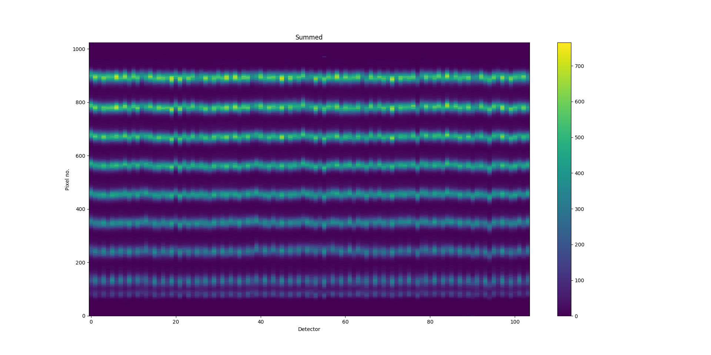
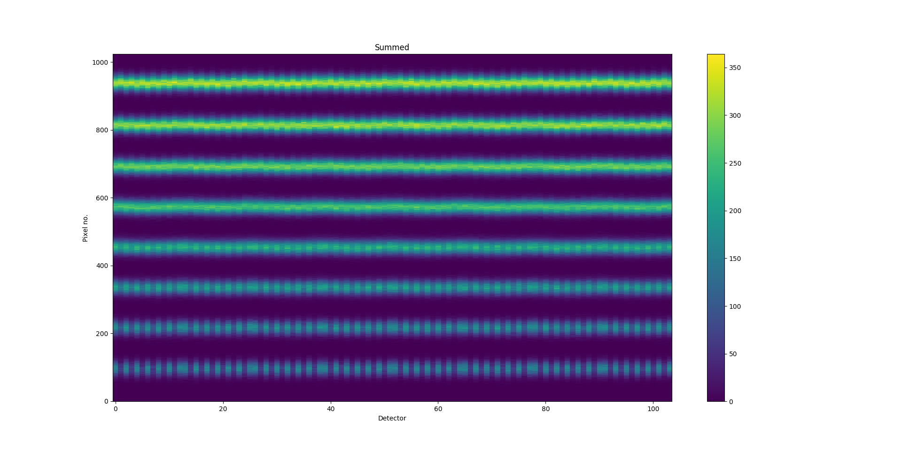
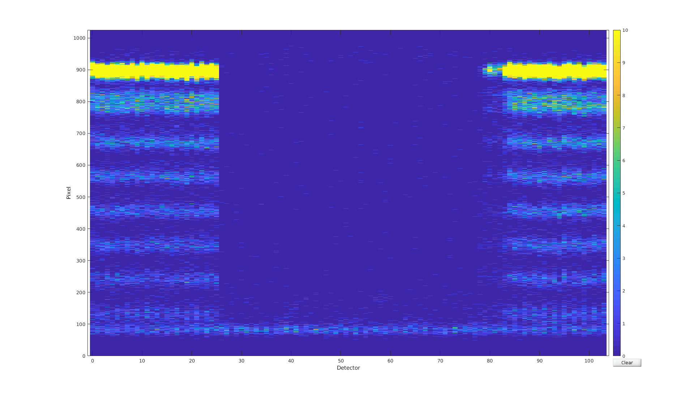

01/11-18 - First Vanadium normalization scan
^^^^^^^^^^^^^^^^^^^^^^^^^^^^^^^^^^^^^^^^^^^^

First scan has been conducted of a Vanadium sample with variable :math:`E_i`  as shown in figure VanScan_ with scan file name camea2018n000038.hdf

.. _VanScan:

  Summed overview of neutron counts for scan of :math:`E_i` from 3.0 meV to 5.5 meV in 501 steps (:math:`\Delta E_i = -0.005`).

.. _VanScanSim:

  SIMULATION: Summed overview of neutron counts for scan of :math:`E_i` from 3.0 meV to 5.5 meV in 401 steps (:math:`\Delta E_i = -0.00625`).

Assuming that the primary instrument is somewhat well-aligned the above data set is used for the normaization and determination of :math:`E_f` .

Further studies have been conducted in the persuit for reducing the background below pixel 100 in all tubes. Following has been found:

- Background is present for all energies. 
- Background seems to be independent of A4 (or slightly)
- Background is dependent on neutron count through slits. (Dependts higly on slit openings)
- Background is gone when A1 is wrong, instrument shutter is in, or slits are closed
- Background increases with plastic or Vanadium as sample but is also present without sample
- Background remains despite shielding mat being in front of Be filter (see MatPicture_)

One of the current explanations is that air scattering moves neutrons from sample area to material under the tank generating gammas. These then enter the tank and are eiter wrongly interpreted at detector resutling in increased background at pixel 100. Or, they are weak enough to be absorbed by cross talk schielding thus only allowing gammas to reach detectors at pixel 100.

.. _MatPicture:

  Detector overview with shielding mat just in front of the middle part of Be filter. As seen, the background remains while neutrons are completely blocked.

