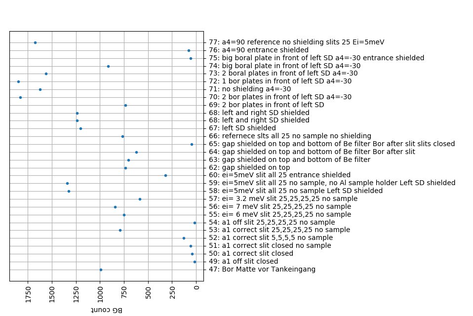

02/11-18 - Background hunting
^^^^^^^^^^^^^^^^^^^^^^^^^^^^^

After many attempts to shield different parts of the instrument with borated plastic and boral it was found that the neutrons can actually go through a tiny 'slit' between the Be filter and the cross talk shielding. This gab only exists in the front as the shielding after the last analyser bank has a boral plate to cover the direct line.

  
  Overview of background measurements with the scan title and number