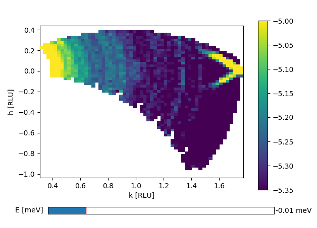

04/12-18 - Magnet force test and Startup of LSCO
^^^^^^^^^^^^^^^^^^^^^^^^^^^^^^^^^^^^^^^^^^^^^^^^

Today, the MA15 was mounted at the sample table to test forces excerted by the magnet on the monochromator and magnet on the secondary spectrometer. No malfunction of anything during ramping up til 12 T and forces are towards the monochromator and of same strengths as earlier with the RITA2 tank. Conclusion: Tank is not a problem in magnetic field.

Startup of LCSO 5% doped sample. Measurements at :math:`E_i` 5 meV elastic. Signal is very weak but this was expected from measurements on Thales.

