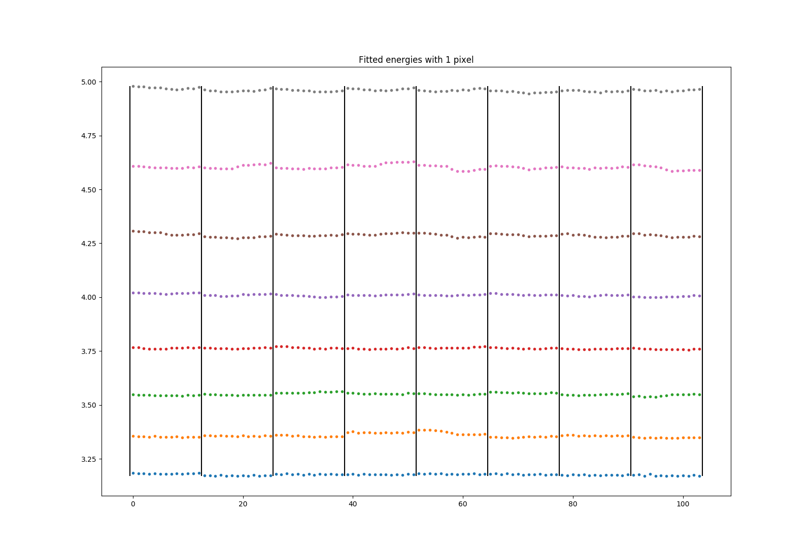
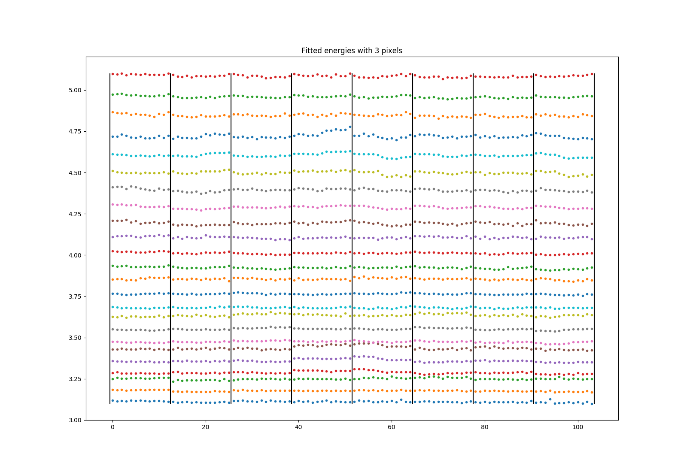
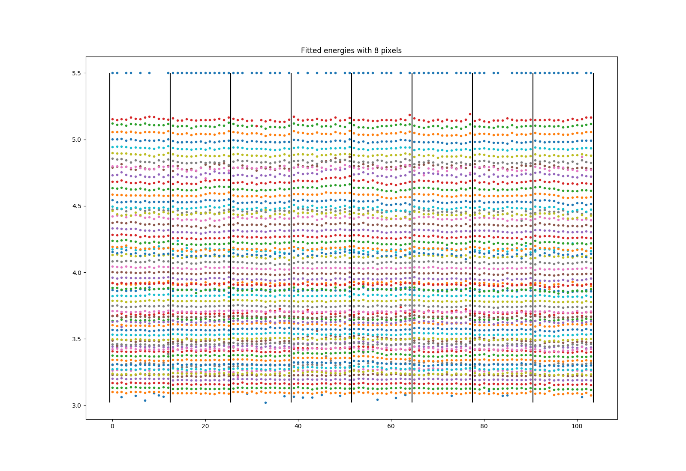
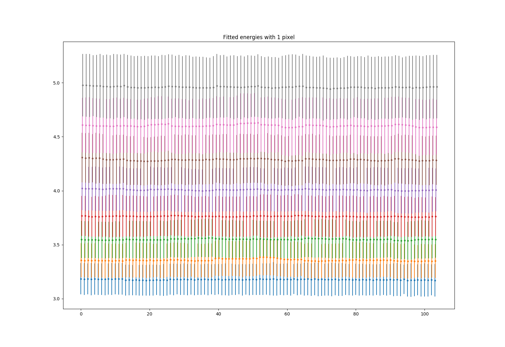

05/11-18 - Energy normalization
^^^^^^^^^^^^^^^^^^^^^^^^^^^^^

With the energy scan using a curved monochromator and Vanadium, data file 'camea2018n000038.hdf', the following three energy diagrams is found. It is noticable that due to the excess background around pixel 80 across all tubes, and the crude method of masking these when finding energies, the lowest energy of the 3.2 meV analyser bank for 8 software pixel does not converge. This then results in rather arbitrary values found.
The values of 1 pixel binning can be found in the table in :ref:`291018<EfTable>` .

For the FWHM values, below the energy width for 1 pixelation is shown.

