05/11-18 - Energy normalization
^^^^^^^^^^^^^^^^^^^^^^^^^^^^^^^

With the energy scan using a curved monochromator and Vanadium, data file 'camea2018n000038.hdf', the following three energy diagrams is found. It is noticable that due to the excess background around pixel 80 across all tubes, and the crude method of masking these when finding energies, the lowest energy of the 3.2 meV analyser bank for 8 software pixel does not converge. This then results in rather arbitrary values found.
The values of 1 pixel binning can be found in the table in :ref:`291018<EfTable>` .

.. figure:: EnergyNormalization_1pixels.png
  :width: 60%
  :align: center

.. figure:: EnergyNormalization_3pixels.png
  :width: 60%
  :align: center

.. figure:: EnergyNormalization_8pixels.png
  :width: 60%
  :align: center

For the FWHM values, below the energy width for 1 pixelation is shown.

.. figure:: EnergyNormalization_1pixels_EB.png
  :width: 60%
  :align: center

Pixel area and fit
^^^^^^^^^^^^^^^^^^
Below are the active areas of detector tubes 39, 40, 45, 46, 50, and 51. These tubes are the four outer most in wedge 4 as well as the middle in the upper and lower layers.

|Raw39| |Raw45| |Raw50|

|Raw40| |Raw46| |Raw51|

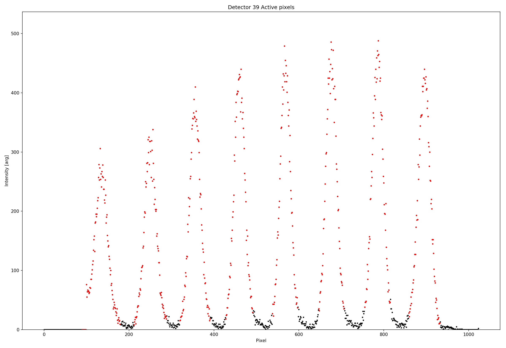

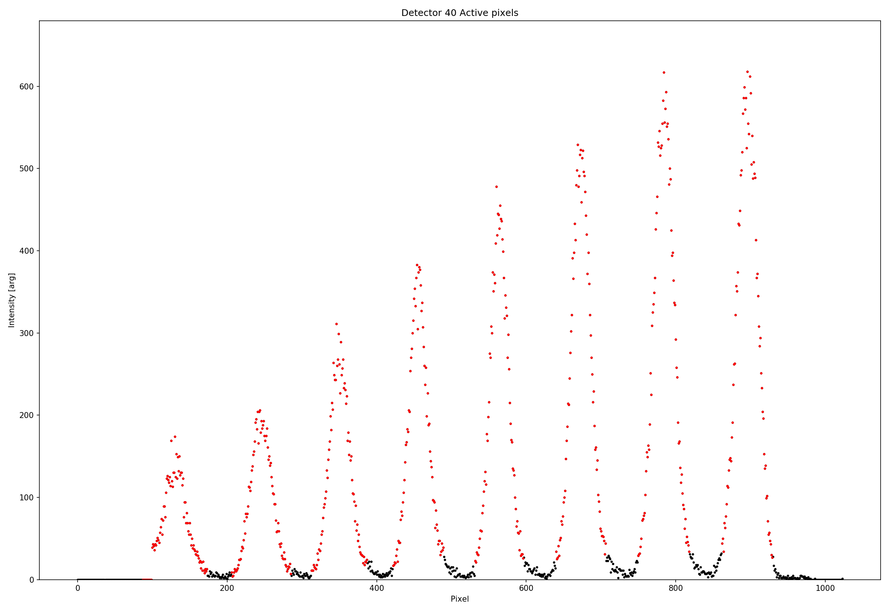

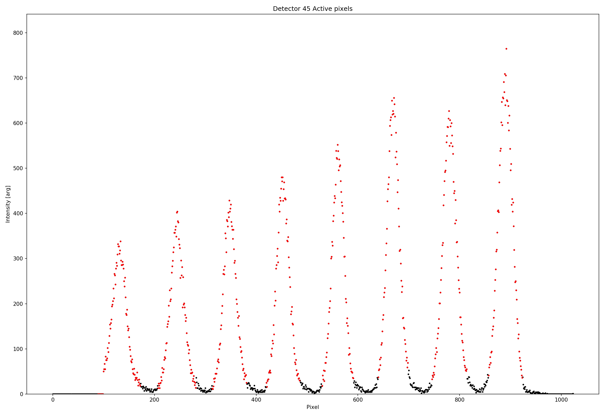

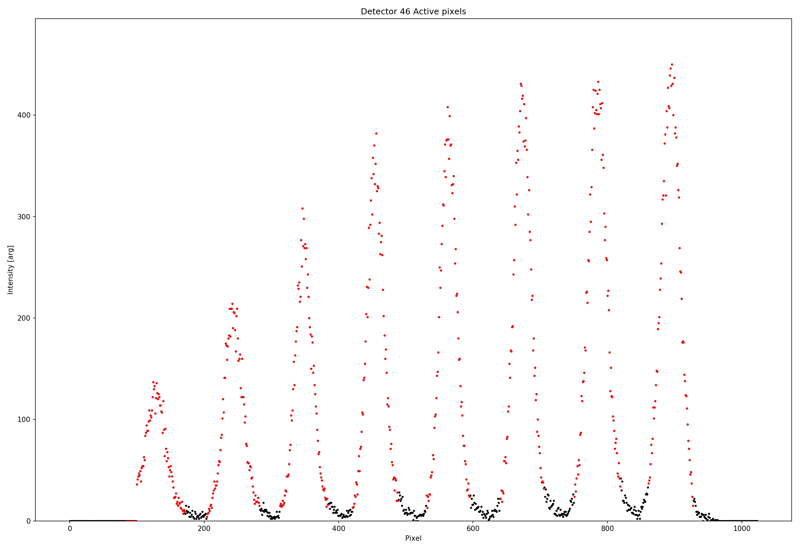

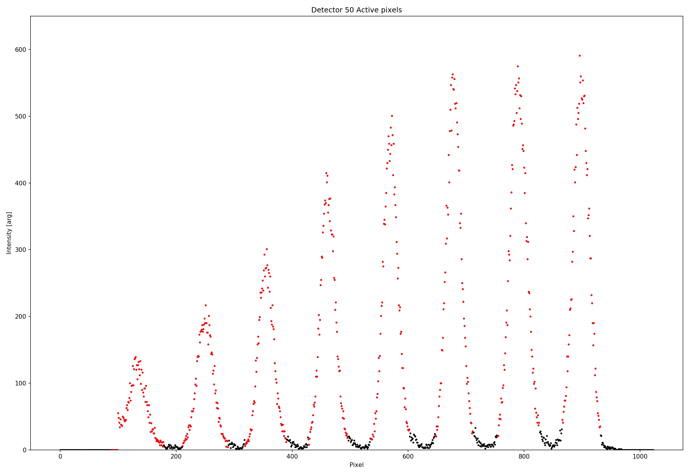

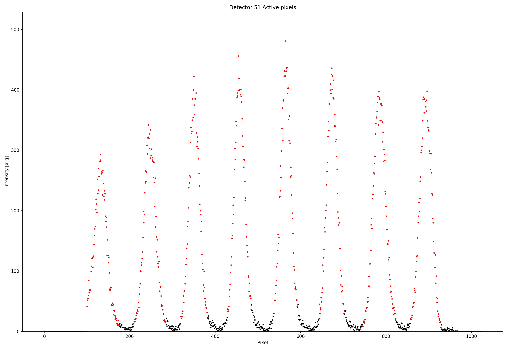

Pixel binning 1, 3, and 8
^^^^^^^^^^^^^^^^^^^^^^^^^
Using all of the pixel binnings for detector tubes 39, 45, and 51 results in the following positions

|39Pixel1| |39Pixel3| |39Pixel8|

|45Pixel1| |45Pixel3| |45Pixel8|

|51Pixel1| |51Pixel3| |51Pixel8|

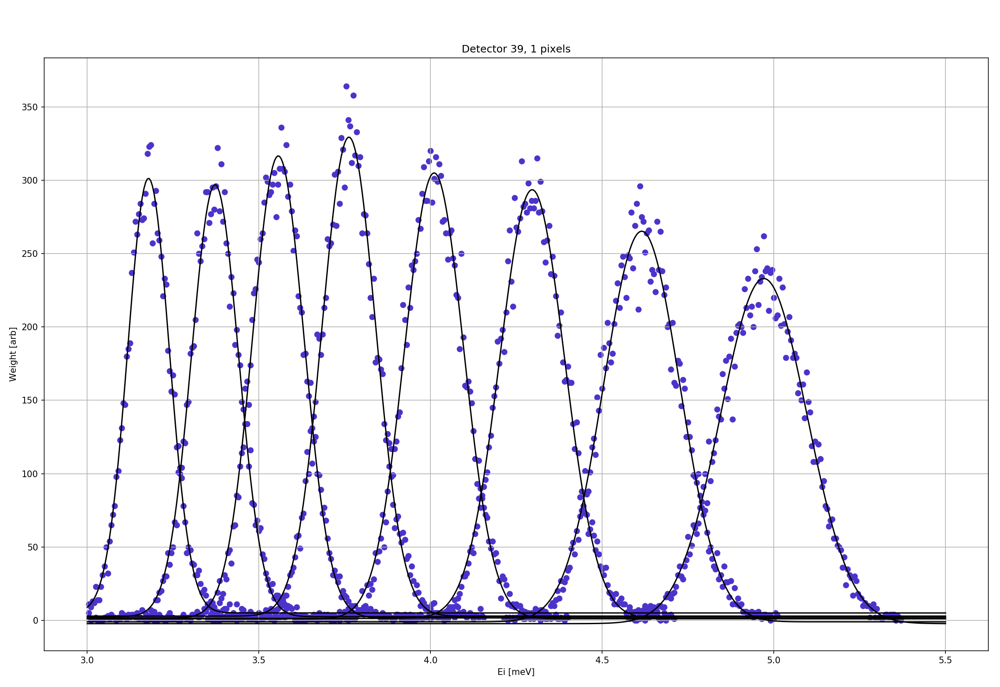

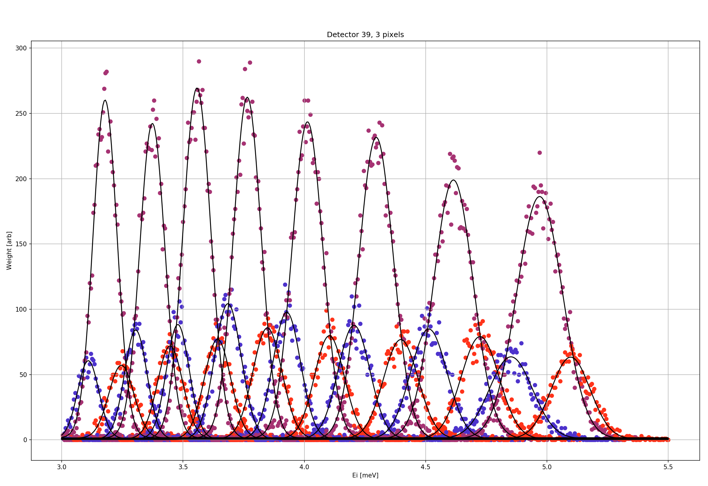

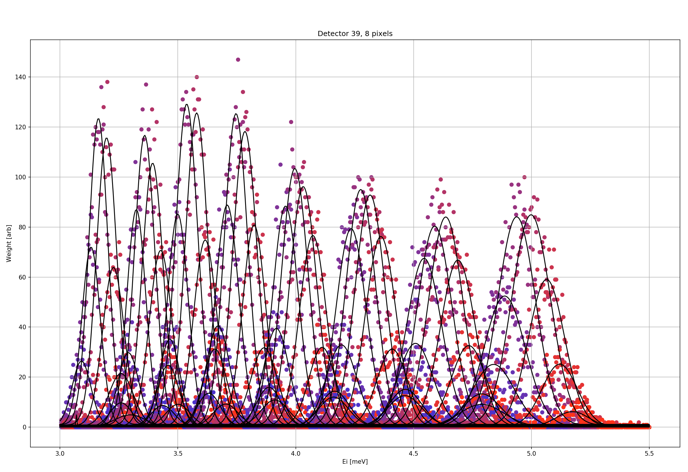

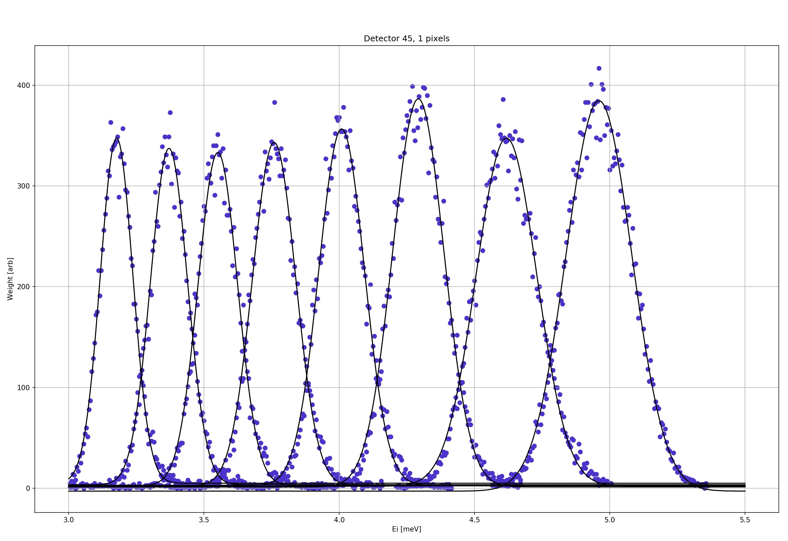

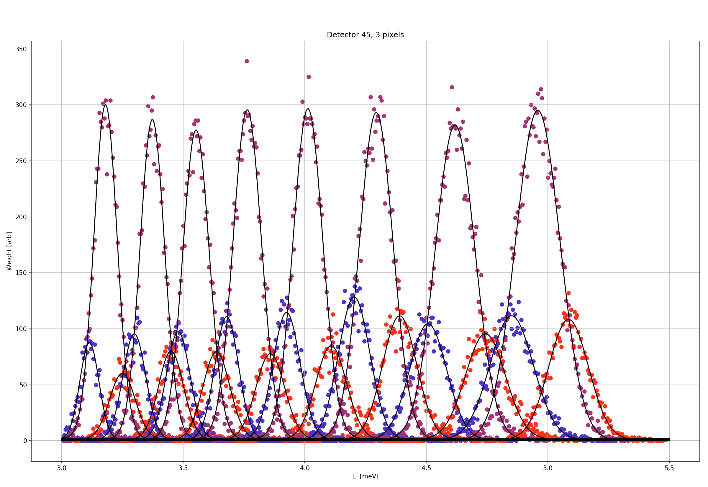

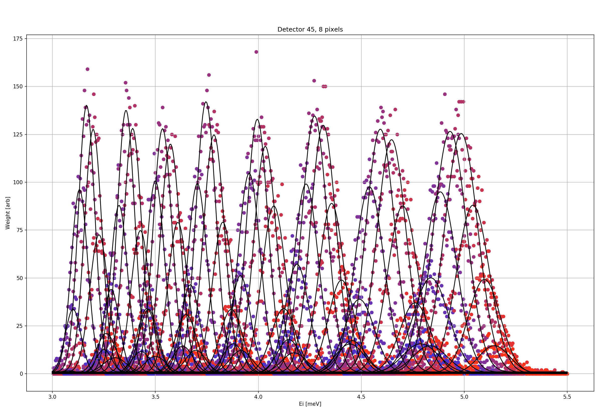

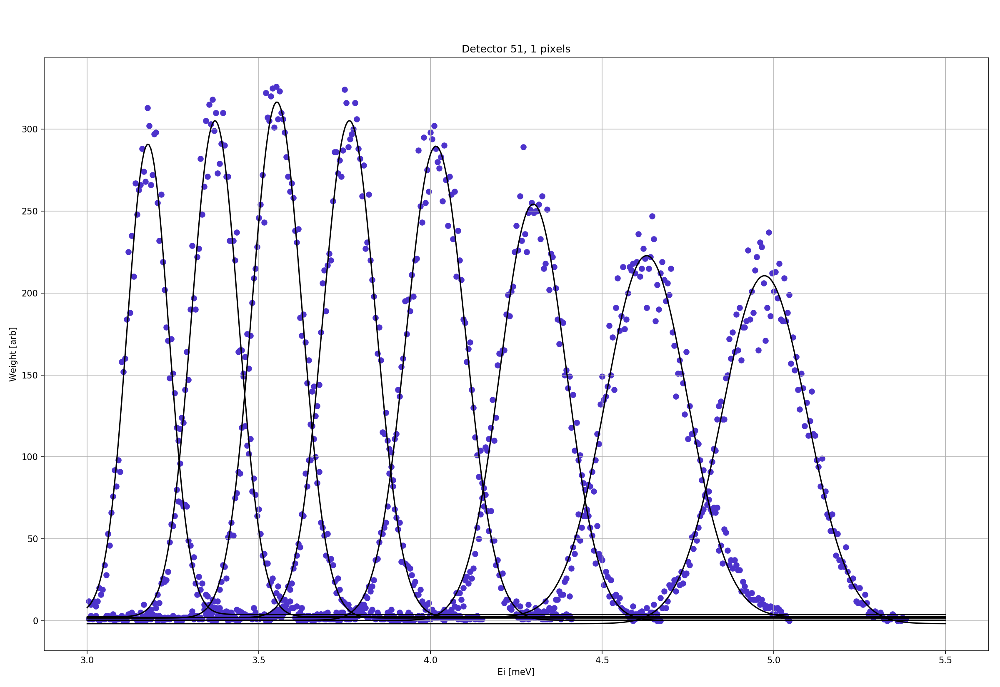

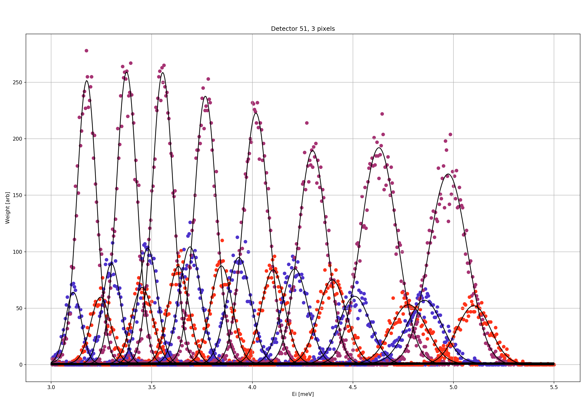

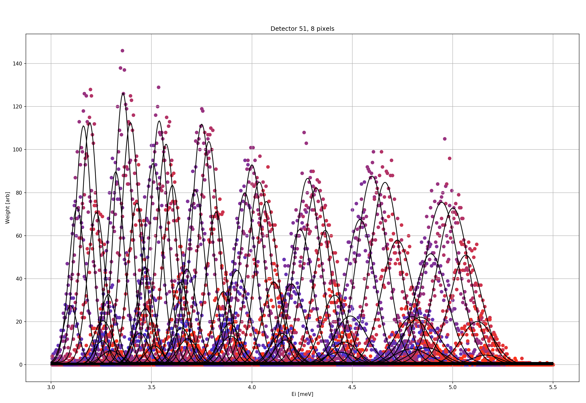

