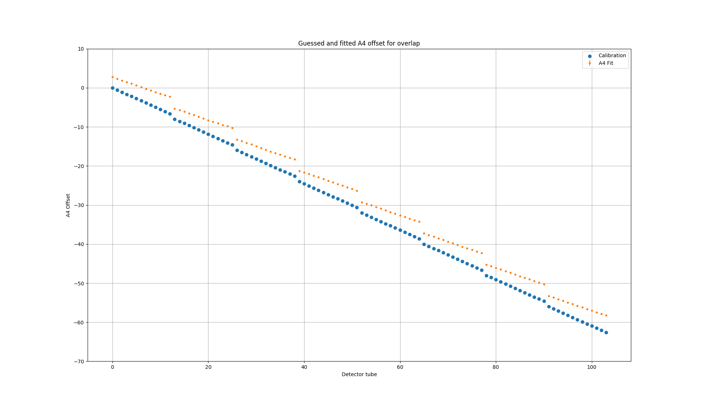

06/11-18 - Determination of A4 + Be filter cooling
^^^^^^^^^^^^^^^^^^^^^^^^^^^^^^^^^^^^^^^^^^^^^^^^^^

Whilst the Be filter has been cooling, the :math:`2\theta` data has been analysed. It is specifically files 87 and 88 containing :math:`2\theta` scans for AlO ay 5 meV. The files contains a scan on each side of the direct beam. As 5 tubes are measured on both sides, these for the basis for determining the proper sample :math:`2\theta` .
This follows from the fact that the scattering angle is to be negated when moving to the other side of the direct beam while the offset is the same. In an equation, if the AlO peak is found at :math:`C_1=2\theta_S+\theta_{off}` and the other at :math:`C_2=-2\theta_S+\theta_{off}` then the actual scattering angle is :math:`2\theta=\frac{C1-C2}{2}` . For the given data, the value was found to be 71.1082 :math:`\pm` 0.0008 degrees.
By subtracting this from all of the other fits, the graph below is found. As seen, there is a general offset for all wedges of 3.52 :math:`\pm` 0.03 degrees between the found and the calibration table. Further, the :math:`2\theta` step size between the tubes is also different than the calibration files. This is due to the out of plane scattering as described in :ref:`Geometry<InstrumentFig>`.

.. _2thetaAlOOffset: 

From the found sample scattering angle, assuming that the lattice paramters are known, the true incoming energy can be found through the regular Bragg scattering condition with the powder ring peak being (0,2,1) of AlO. This is found to be :math:`E_i=4.993192` meV, which compared to the one written in the data file as 4.999995 meV is quite close.