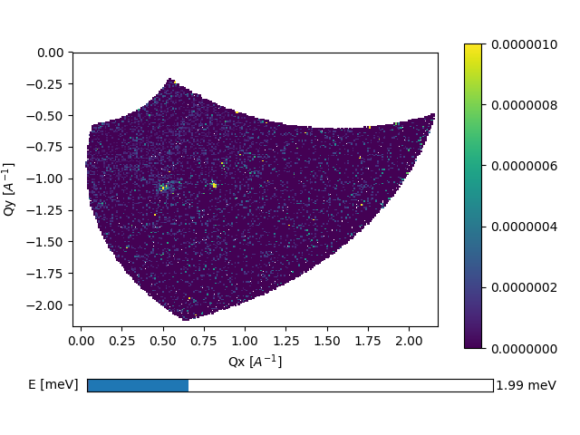
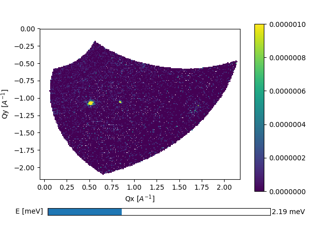
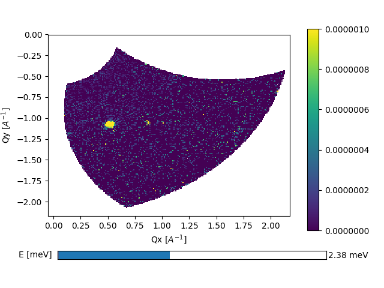
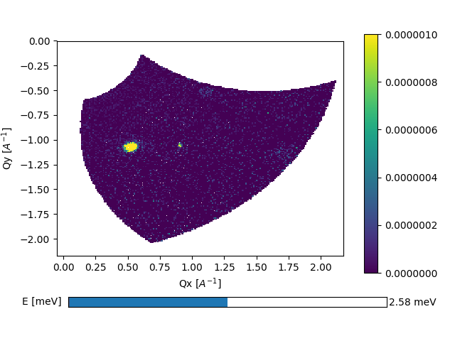
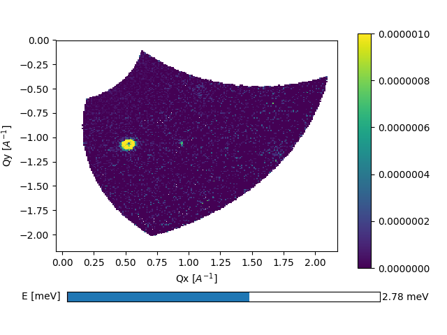
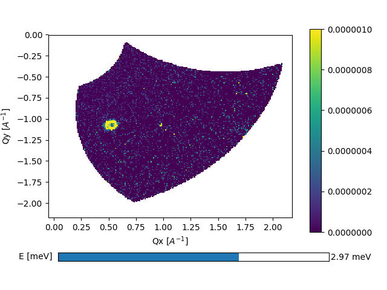
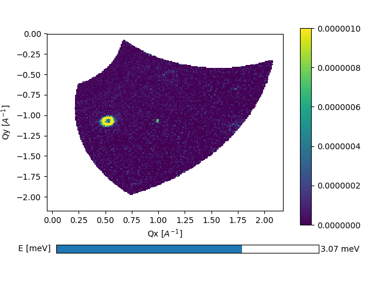
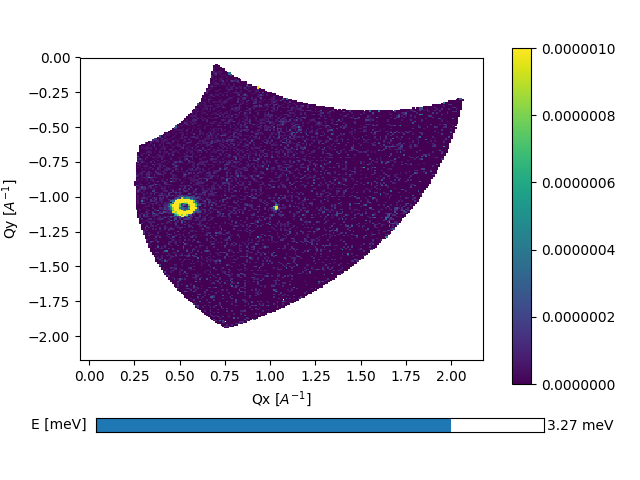
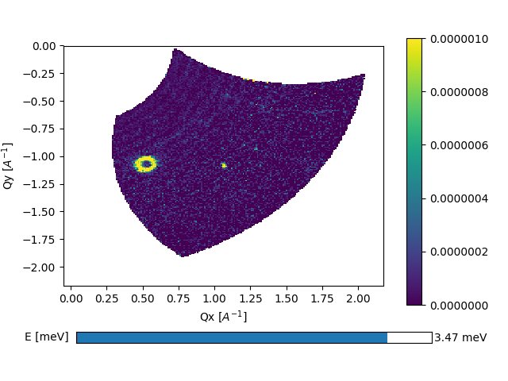

09/11-18 - First magnong in YMnO3
^^^^^^^^^^^^^^^^^^^^^^^^^^^^^^^^^
By performing 2 A3 scans with 0.5 step size and 121 points, counting roughly 3 minuts/point and :math:`2\theta` of -20 and -40 degrees, the scans shown below are found.

|199| |219| |239| 
|258| |278| |297|
|307| |327| |347|

