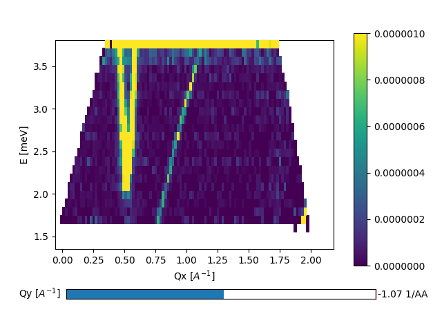

10/11-18 - Magnon in YMnO3
^^^^^^^^^^^^^^^^^^^^^^^^^^

The previous scans has shown that the background is really good and low. However, there is a spurious signal which moves in Q-E space. It is seen in all of the constant energy plots as a sharp dot and moves towards the (1,0,0) magnetic Bragg peak when going down in energy transfer, c.f. below. Currently it is believed that the signal originates from the strong Bragg peak that is transmitted through the filter (tough increased in strength) and somehow gets scattered in the analysers.

|Spurion|

