17/11-18 - Magnon in YMnO3
^^^^^^^^^^^^^^^^^^^^^^^^^^

With the combination of incoming energies :math:`E_i` and angles :math:`A4` the following data has been taken. As seen, the two spin waves emerge and overlap as expected. The following settings has been measured:

- 161: A4: 84.000 deg, A3: -20.000 - 20.000 deg, Ei 6.800 meV
- 162: A4: 80.000 deg, A3: -20.000 - 20.000 deg, Ei 6.800 meV
- 163: A4: 84.000 deg, A3: -10.000 - 30.000 deg, Ei 8.500 meV
- 164: A4: 80.000 deg, A3: -10.000 - 30.000 deg, Ei 8.500 meV
- 165: A4: 76.000 deg, A3: -0.000 - -0.000 deg, Ei 10.200 meV
- 166: A4: 76.000 deg, A3: -0.000 - 40.000 deg, Ei 10.200 meV
- 167: A4: 80.000 deg, A3: -0.000 - 40.000 deg, Ei 10.200 meV
- 168: A4: 76.000 deg, A3: 7.000 - 47.000 deg, Ei 11.900 meV
- 169: A4: 80.000 deg, A3: 7.000 - 47.000 deg, Ei 11.900 meV

.. note::
    The dispersion is measured on the + + scattering side to check resolution.

|dE2_3| |dE2_85| |dE3_6|
|dE4_3| |dE5_3| |dE5_7|
|dE6_0| |dE6_4| |dE6_8|
|dE7_3| |dE7_9| |dE8_5|

|Qx0_7| |Qy0_9|

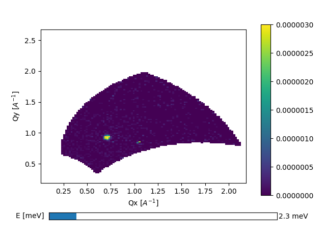
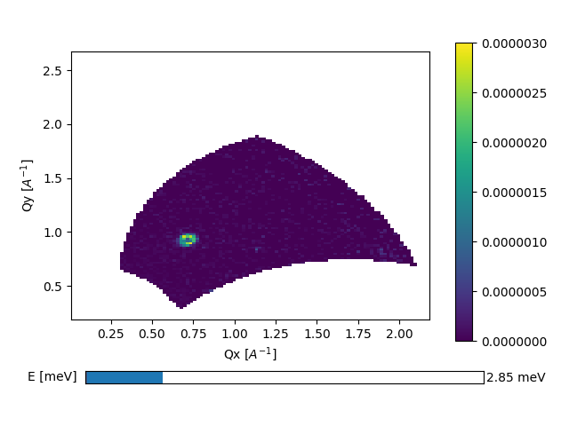
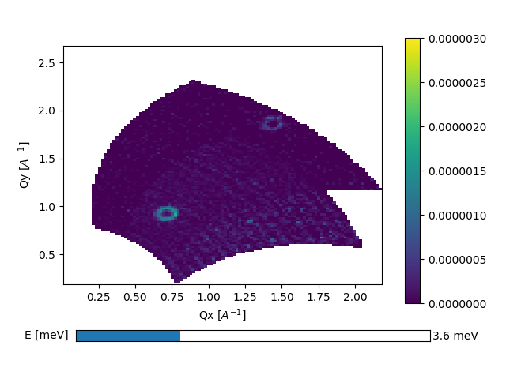

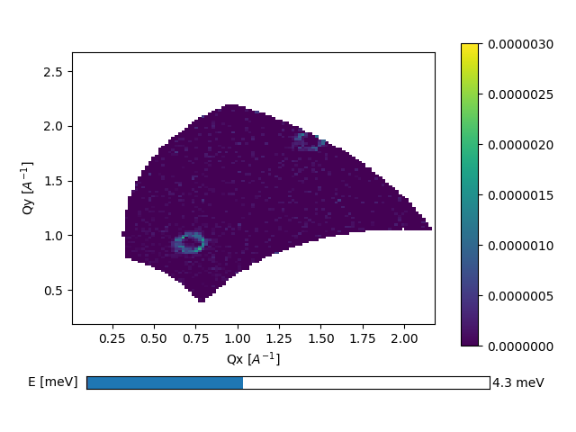
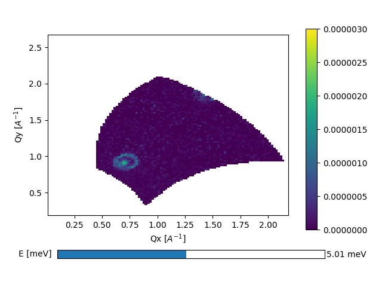
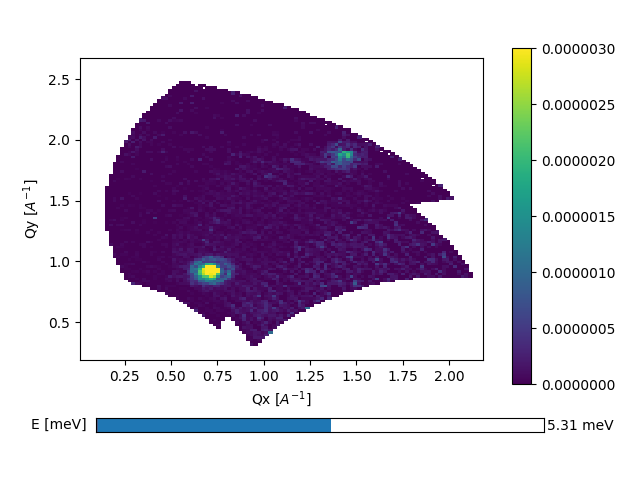
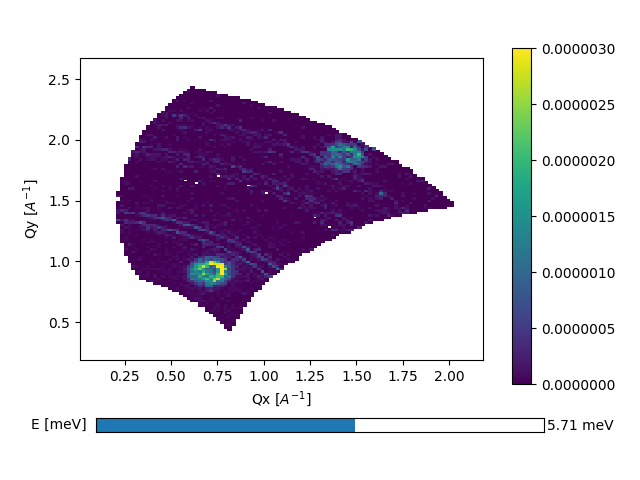
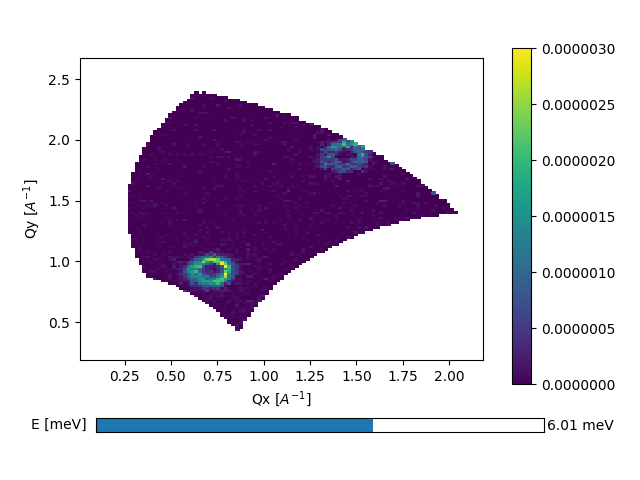
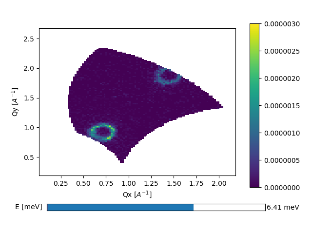
.. |dE6_8| image:: FullMap/dE6_8.png
   :width: 32%
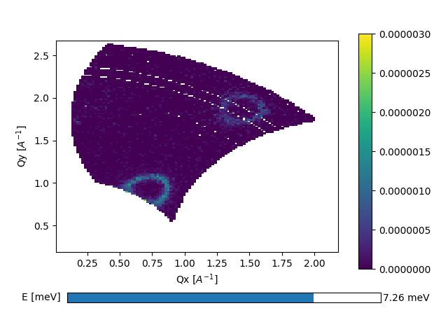
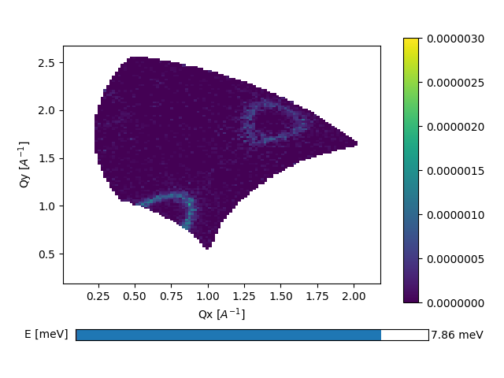
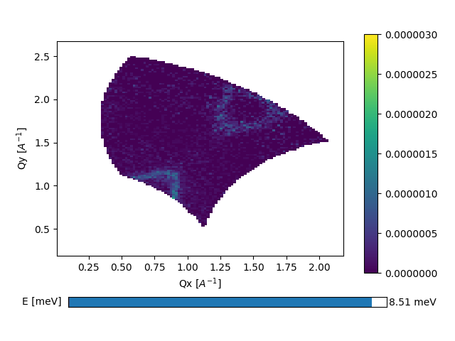
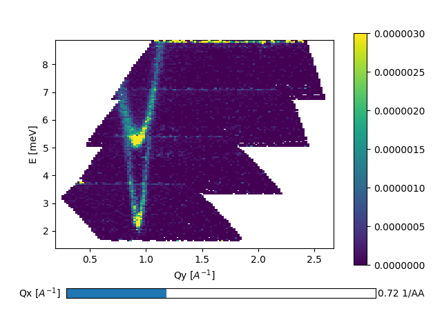
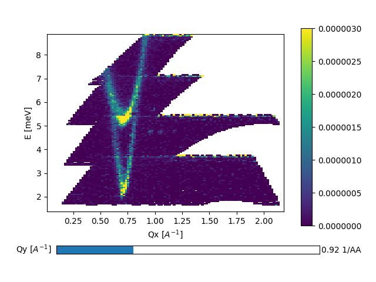

Diffuse scattering
^^^^^^^^^^^^^^^^^^

|dEDiffuse1| |dEDiffuse2|

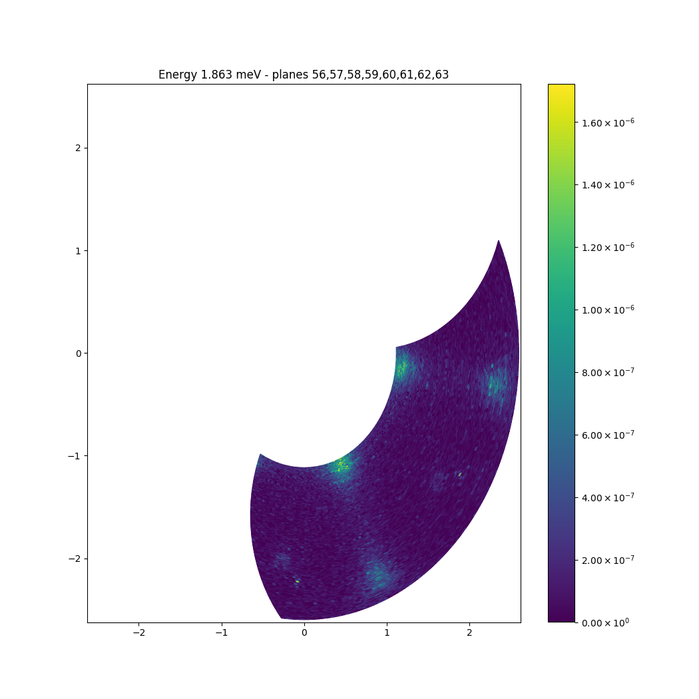

