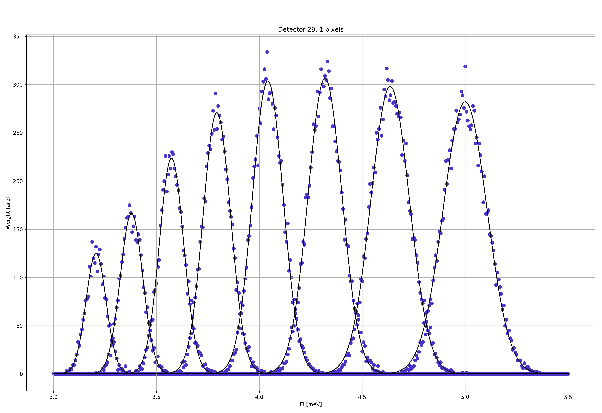
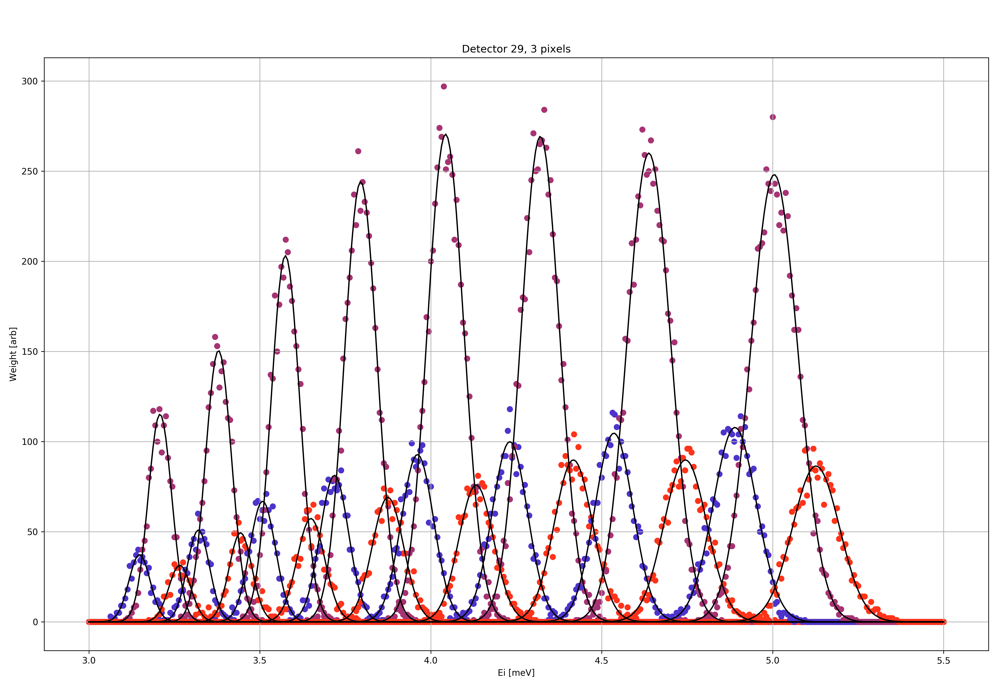
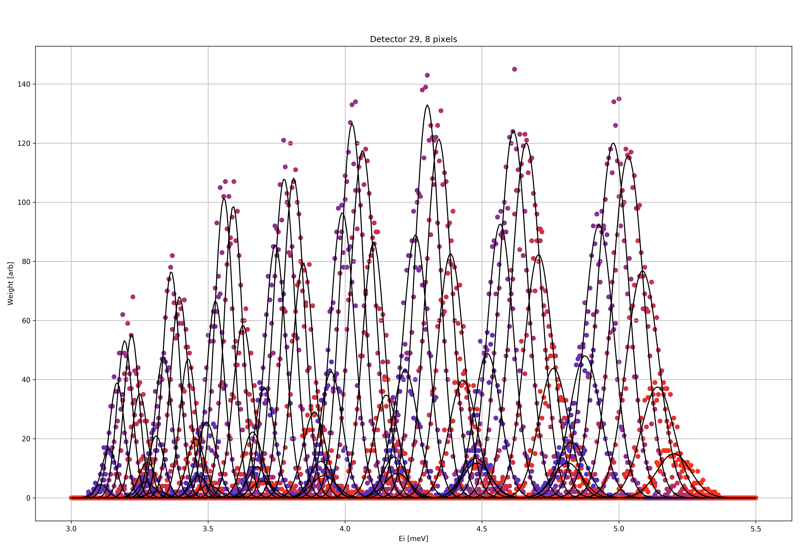

Energy normalization procedure
==============================

The following is a walk-through of the energy normalization method as performed by the MJOLNIR Data module when given a data file containing scattering data from scanning incoming energy, :math:`E_i`, with a Vanadium sample.

The raw data file is opened and the intensities of all pixels and all detectors are extracted. Further, the number of pixels, detectors and wedges are found. 

Determination of active area
----------------------------

In order to determine the active area of each detector, and indeed of each detector segment looking at a given analyser, the intensity data as function of pixel, detector, and energy is collapsed along the energy direction. This results in graphs like in figure EnergySummed_ below. From this, it is clear that not all pixels are active and that the splitting into software pixels depend on the detector/analyser combination.  

.. _EnergySummed:                                         
                                                        
  .. figure:: Figures/detector29.png       
    :width: 50%   
    :align: center                                             
                                              
    Intensity of detector tube 29 when summing across energies for Vanadium sample.

By fitting a suitable amount of Gaussians to all of the peaks, one obtains the intensity center for each energy on the detectors and from this, one can determine the active area, as seen in figure GaussFitWedge_. The procedure to find the peaks and fit the Gaussian functions is to first find the maximal intensity, estimate the width from prior knowledge of the set-up, fit the Gaussian and then subtract the fit. This is then repeated for the necessary number of times needed. This method does, however, depend on the signal being described by a Gaussian to an extend that the data with the fit subtracted has a small remainder. If the difference is too big, the algorithm cannot find all the peaks and an error is raised. 
Currently the active area is defined as pixels within the center :math:`\pm 3\sigma`. This makes it possible to use around 99.74% of the intensity. However, making this area too broad allows pixels with very low statistics to be used in experiments introducing a high uncertainty on the measured intensity. 

.. _GaussFitWedge:                                         
                                                        
  .. figure:: Figures/Fit_wedge_4.png       
    :width: 75%   
    :align: center                                             
                                              
    Fit of all peaks for wedge 4 allowing determination of center and width.

.. _ActiveArea:                                         
                                                        
  .. figure:: Figures/Active_29.png           
    :width: 50%   
    :align: center                                             
                                              
    Intensity of detector tube 29 with active area shown in red.

For the current width used for active area, the red points in the above figure ActiveArea_ is used. 

Software pixel binning
----------------------

With the knowledge of the positions and widths of the active areas on the detectors, one needs to define the 
pixel edges for all of the software pixels. The number of pixels in each software pixel depends on both the 
width of the active area on the detector and the number of software pixels into which the user wants to bin. 
Usually, the number of software pixels is between 1 and 8, where a case of 8 pixels is shown in figure 
SoftwarePixels_ below. Then, using the raw intensity the signal is binned into software pixels as function of energy. 
These are then individually fitted with a Gaussian as to precisely determine the center energy, normalization, 
width, and possible background. 

.. _SoftwarePixels:                                         

  |1Pixel| |3Pixels| |8Pixels|

  Fit of one, three, and eight software pixels to Vanadium normalization for the 29th detector tube.

    

It merely remains to save the obtained normalization into a file, which is done in the CSV format. 
For each detector, analyser, and software pixel the following parameters are saved:

::

   Normalization for 8 pixel(s) using data TestData/VanNormalization.h5
   Performed 2018-04-05 13:22:29.008053
   Detector,Energy,Pixel,Amplitude,Center,Width,Background,lowerBin,upperBin
   0,0,0,553.307499792,3.11194470068,0.0351916686546,-1.14865525492,25,30
   0,0,1,3534.65749131,3.13586570375,0.0234845709327,2.79927766486,30,35
   0,0,2,6707.93446507,3.17045382964,0.0296278355214,-2.44445514979,35,40
   0,0,3,8449.34235339,3.19740050283,0.0279281924646,0.147005539459,40,44
   0,0,4,7762.45025046,3.22095475304,0.029643268258,-3.43488524431,44,48
   0,0,5,5700.97166402,3.25044106789,0.0305651479509,-0.633300325994,48,53
   0,0,6,2117.92181626,3.28390443811,0.0270144206303,1.62528891194,53,58
   0,0,7,269.377490747,3.31657107929,0.0341873820177,-0.0625227707394,58,63
   ...

The CSV file is saved and is used when converting experiment data from raw HDF files into NXqom 
files explained in the Data file conversion documentation. 

