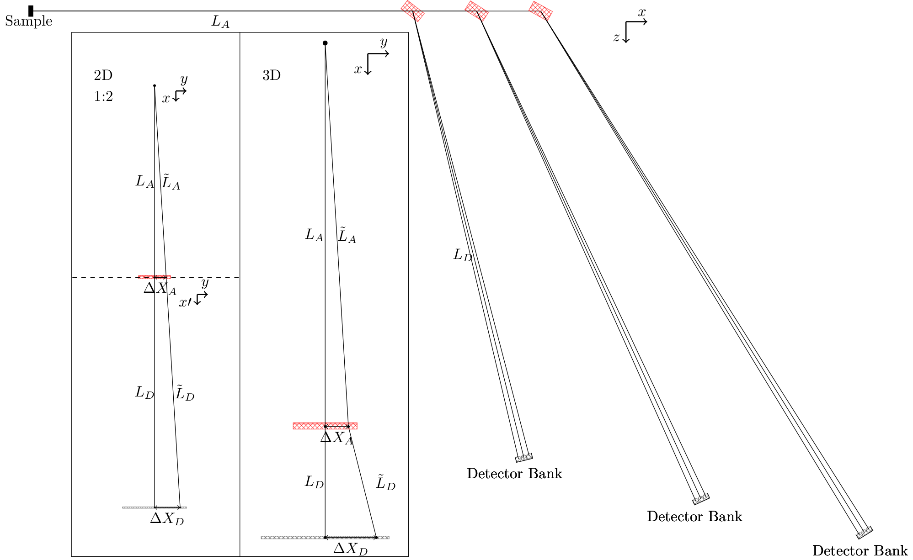

Geometry
======== 

.. warning::

    Assumptions made by the program:
     - Incoming beam is along :math:`(0,1,0)`, i.e. the y-axis
     - Sample is located at :math:`(0,0,0)`
     - Only first order scattering
     - Energies and A4 is calculated independently of the rotation of the analyser, i.e. infinite mosaicity is assumed 
     - Analysers are flat, tangental, and without focusing in the tangental plane.
     - Detectors are horizontal
     - All analysers in a wedge are made from the same material.

The calculation of energies and the corresponding scattering angles is automatically calculated when the initialization method is called on the :doc:`Instrument<../Geometry/Geometry>` object. That is, one first of all needs to create the wanted instrument with all of the detectors, analysers and wedges as described in the instrument creation tutorial :doc:`Build a simple instrument<../Tutorials/BuildSimpleInstrument>`. Having done all this, the procedure for the calculations is as follows. 

Looping through all wedges, the concept attribute is checked. This tells whether one has a one to one correspondence between the detectors and the analysers or a many to many. The prior is true for secondary spectrometers as FlatCone or MultiFLEXX, where each detector optimally receives neutrons from only one analyser. The latter is, however only in the sense of many to one, true for the CAMEA concept applied at SINQ. Here one detector receives neutrons from multiple analysers. The need for this distinction in the code is for the algorithm to know, if it should split the detector pixels up in bunches or not. These bunches are controlled by the attributes for the :doc:`Detector<../Geometry/Geometry>` object. In both cases, the relative position vector is found for each pixel and the corresponding analyser as well as the vector from origo to the analyser. As described below, the actual optimal scattering position is then calculated and returned to the instrument object. Having both the detector position as well as the scattering position at the analyser, it is straight forward to calculate scattering angle :math:`A4` and corresponding final energy :math:`E_f`.

.. _InstrumentFig: 

Visualization of scattering planes used for the calculation of scattering angle and final energy.

The math behind finding the optimal scattering position for a given pixel at the analyser is as follows. Noticing that the neutron cannot have a change in its momentum perpendicular to the scattering plane, one can make a 2D drawing of the trajectory of the neutron from the sample to the detector as in the left of figure InstrumentFig_. Here it is important to note that the dashed line signifies a bend of the trajectory as depicted in the 3D subfigure in the inset to the right. The discrepancy between the two is that in the latter a projection from 3D to 2D is used; the neutron is scattered out of the plane. Accepting the 2D depiction, one can notice, that the two triangles Sample-AnalyserCenter-DeltaXA and Sample-DetectorCenter-DeltaXD have the same angles. Thus

.. math::

   \frac{\Delta X_D}{L_A+L_D} = \frac{\Delta X_A}{L_A} \Rightarrow \Delta X_A = \frac{\Delta X_D}{\frac{L_D}{L_A}+1}.

This calculation is slightly more complex if one does not assume that both the analyser and the detector are tangental to the sample-detector vector. One then needs to find the distance away from the scattering direction, the pixel is moved. Before, this was just given by the pixel position relative to its centre, :math:`\Delta X_D`, but is now given as a dot product between the relative position and the vector perpendicular to the scattering direction:

.. math::
   
   \Delta X_D = \left(\vec{P}_\mathrm{pos}-\vec{P}_\mathrm{det,centre}\right) \cdot \vec{L}_{\perp},

where :math:`\vec{P}_\mathrm{pos}` is the pixel position, :math:`\vec{P}_\mathrm{det,centre}` is the center position of the pixel and :math:`\vec{L}_{perp}` is the vector perpendicular to the scattering direction and is in the horizontal plane. With this correction, the above formula for position on the analyser still holds true, and one can thus find the scattering position. By simply using the cosine relation, where the angle :math:`\theta`between two vectors, :math:`\vec{a}` and :math:`\vec{b}` is given by

.. math::

   \cos(\theta) = \frac{\vec{a}\cdot\vec{b}}{|\vec{a}|\,|\vec{b}|},

one can find the angle between the incoming beam and the scattering direction, denoted :math:`A4`. Further, the final energy :math:`E_f` is found in a similar sense, where the angle between sample-analyser and analyser-detector is found and converted into an energy by the usual elastic scattering formula

.. math::

   \lambda = 2d\sin(\theta)\qquad \mathrm{and} \qquad E = \left(\frac{9.0445678\mathrm{A}\sqrt{\mathrm{meV}}}{\lambda}\right)^2.

Here the algorithm uses the d-value specified for the first analyser in the wedge. This could of course be generalized to allow for different analyser materials, but is not yet done as this would complicate the code further and is not believed to be relevant.

