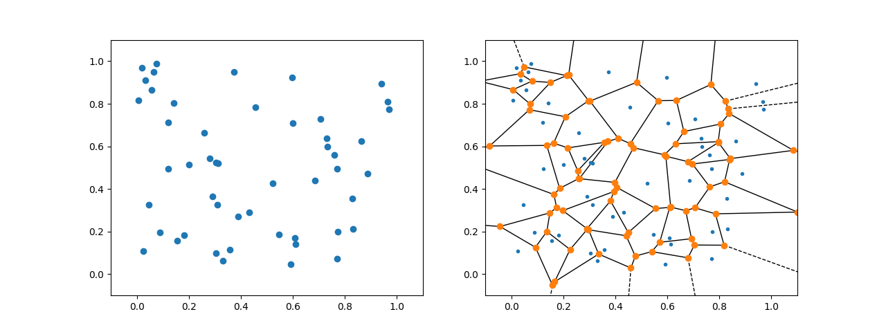
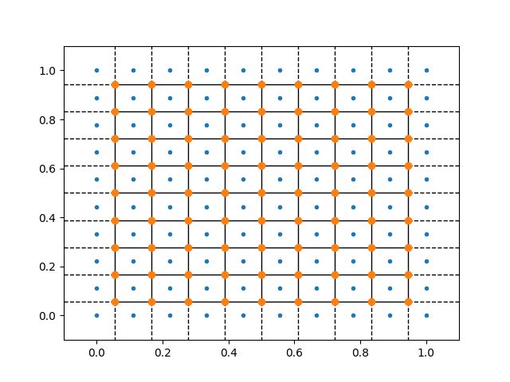

Voronoi tessellation and plotting functionality
^^^^^^^^^^^^^^^^^^^^^^^^^^^^^^^^^^^^^^^^^^^^^^^

With all of the effort but into building a instrument acquiring as much 
data and data points as possible, it is sensible to have a plotting 
algorithm that then shows all of these. This is exactly what the two 
methods plotA3A4 and plotQPatches seek to do. However, performing 
calculations and plotting all of the measured points make the methods 
computationally heavy and slow as well as presents challenges for the 
visualization. Below is a list of difficulties encountered while 
building the two methods. 

Difficulties:

- Handle (almost) duplicate point positions
- Generate suitable patch around all points
- Number of points to handle

The methods do address some of the above challenges in some way; the 
almost duplicate points are handled by truncating the precision on the 
floating point values holding the position. That is, 
:math:`\vec{q}=\left(0.1423,2.1132\right)` is by default rounded to 
:math:`\vec{q}=\left(0.142,2.113\right)` and binned with other points 
at the same position. This rounding is highly relevant when generating 
patches in :math:`A3`-:math:`A4` coordinates as the discretization is 
intrinsic to the measurement scans performed.

What is of real interest is the generation of a suitable patch work 
around all of the points for which this page is dedicated. The wanted 
method is to be agile and robust to be able to handle all of the 
different scenarios encountered. For these requirements to be met, 
the voronoi tessellation has been chosen. 

Voronoi tessellation
--------------------

First of all, the voronoi diagram is defined as the splitting of a 
given space into regions, where all points in one region is closer 
to one point than to any other point. That is, given an initial list 
of points, the voronoi algorithm splits of space into just as many 
regions for which all points in a given region is closest to the 
initial point inside it than to any other. This method is suitable 
in many different areas of data treatment, e.g. to divide a city map 
in to districts dependent on which hospital is nearest, or divide 
????. This method can however also be used in the specific task for 
creating pixels around each measurement point in a neutron scattering 
dataset. 

The method works in n-dimensional spaces, where hyper-volumes are 
created, and one can also change the distance metric from the normal 
Euclidean :math:`d = \sqrt{\Delta x^2+\Delta y^2+\Delta z^2 \cdots}` 
to other metrics, i.e. the so-called Manhattan distance 
:math:`d = |\Delta x|+|\Delta y|+|\Delta z|+\cdots`. It has, however, 
been chosen that using multi-dimensional and non-Euclidean tessellations 
obscures the visualization of the data rather than enhance it. 
Furthermore, the used SciPi-package spatial_ does not natively support 
changes of metric and a rewriting is far outside of the scope of this 
software suite.

.. _CombiVoronoi:

**Left**: 50 random points generated and plotted in 2D. **Right**: 
Voronoi diagram created for the 50 random points. Blue points are 
initial positions, orange are intersections, full lines are edges 
(denoted ridges) connecting two intersections, dashed lines go to 
infinity.

As seen above, for a random generated set of points, the voronoi tessellation 
is also going to produce a somewhat random set of edges. This is of course 
different, if instead one had a structured set of points as in StructuredVoronoi_ 
below. However, some of the edges still go to infinity creating infinitely 
large pixels for all of the outer measurements. This is trivially un-physical 
and is to be dealt with by cutting or in another way limiting the outer pixels. 

.. _StructuredVoronoi:

Voronoi generated for regular set of data points as for instance an :math:`A3` 
rotation scan with equidistant :math:`A4` points. 

From the above, it is even more clear that the edge pixels extend to infinity. 
This is to be taken care of and two ways comes into mind. First, one could 
define a boundary such that the pixel edges intersecting this boundary is cut 
in a suitable manor. Second, one could add an extra set of data points around 
the actual measurement points in such a way that all of the wanted pixels 
remain finite. Both of these methods sort of deals with the issue but ends up 
also creating more; when cutting the boundary it still remains to figure out 
how and where the infinite lines intersect with it and how to best cut; adding 
more points is in principle simple but how to choose these suitably in all 
case. In the reality a combination of the two is what is used. That is, first 
extra points are added all around the measurement area, generating a bigger 
voronoi diagram; secondly the outer pixels are cut by the boundary. Thus the 
requirement on the position of the additional points is loosened as one is 
free to only add a small amount of extra points (specifically 8 extra points 
are added: above, below, left, right, and diagonally, with respect to the 
mean position).

.. _spatial: https://docs.scipy.org/doc/scipy-0.18.1/reference/generated/scipy.spatial.Voronoi.html

