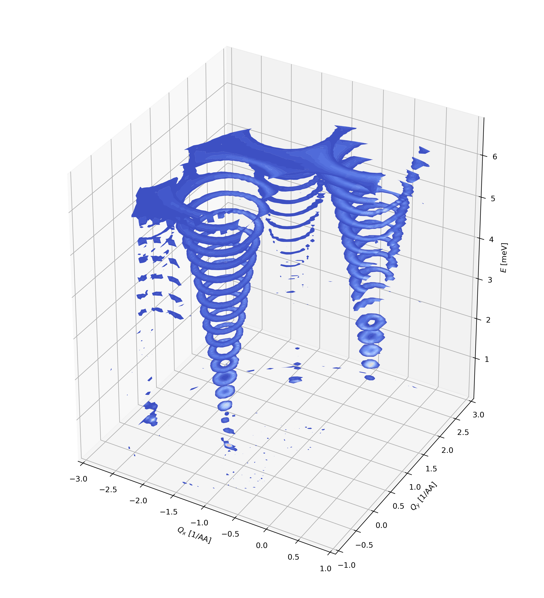

Plotting Q planes for constant energy
^^^^^^^^^^^^^^^^^^^^^^^^^^^^^^^^^^^^^
Plotting the data acquired in 3D is made possible through the plotQPlane method when the "ax" key word is given a 3D matplotlib axis. Providing only an Emin and Emax generates a single plane plotted in 3D at the mean energy position. However, providing a whole range of energies through the key word "EBins" collapses all points inside the energy range and perform the same binning as explained in the `<../Quick/ConstantEnergy.html>`_ tutorial. The code needed to generate a figure is shown below:

.. code-block:: python
   :linenos:

   from MJOLNIR.Data import DataSet
   from MJOLNIR import _tools # Usefull tools useful across MJOLNIR 
   import numpy as np
   import matplotlib.pyplot as plt
   from mpl_toolkits.mplot3d import Axes3D
   
   numbers = '483-489,494-500' # String of data numbers
   fileList = _tools.fileListGenerator(numbers,'/Path/To/Data/',2018) # Create file list from 2018 in specified folder
   
   ds = DataSet.DataSet(fileList)
   ds.convertDataFile(saveFile=False)
   mask = np.zeros_like(ds.I.data) # Define mask, see FAQ for explanation
   mask[:,:,:3]=True
   ds.mask = mask
   
   fig = plt.figure(figsize=(10,11))
   ax = fig.add_subplot(111, projection='3d')
   
   ### Generate own color map with transparency
   from matplotlib.colors import ListedColormap
   cmap = plt.cm.coolwarm
   my_cmap = cmap(np.arange(cmap.N))
   my_cmap[:,-1] = np.linspace(0, 1, cmap.N)
   my_cmap = ListedColormap(my_cmap)
   
   
   
   Energies = np.concatenate(ds.energy,axis=0)
   E = np.arange(Energies.min(),Energies.max(),0.35)
   
   
   [I,Monitor,Norm,NormCount],[xBins,yBins],ax = \
   ds.plotQPlane(EBins=E,ax = ax,xBinTolerance=0.03,yBinTolerance=0.03,
             binning='polar',vmin=2e-7,vmax=2e-5,antialiased=True,cmap=cmap)
   
   ax.set_xlabel('$Q_x$ [1/AA]')
   ax.set_ylabel('$Q_y$ [1/AA]')
   ax.set_zlabel('$E$ [meV]')
   
   ax.set_xlim(-3,1.0)
   ax.set_ylim(-1,3)
   fig.tight_layout()
   fig.savefig('figure0.png',format='png')
   

Making use of the possibility to provide a custom colour map allows for using transparency when plotting. This is shown above where the cmap is created from the "coolwarm" base map and transparency is added as the fourth value taking values from 0 to 1, where 0 is fully transparent and 1 is solid. Playing around with the onset of transparency and the vmin/vmax limits allows the differentiation between signal and background for data sets with good signal to noise. 

Unfortunately, it is not possible to make use of the RLU axis in 3D as this is not supported by Matplotlib. That is, when one gives the "rlu" key word as True all of the data points are rotated such that the principal scattering axis is along the x axis. There is no conversion of units into RLU and the hover over functions are not changed from the defaults. If "rlu"==False data is plotted directly as function of the instrumentally measured :math:`Q_x` and :math:`Q_y`.

.. note::
    The use of transparency can be difficult to save in a picture. However, saving using the png format perserves the transparency. 