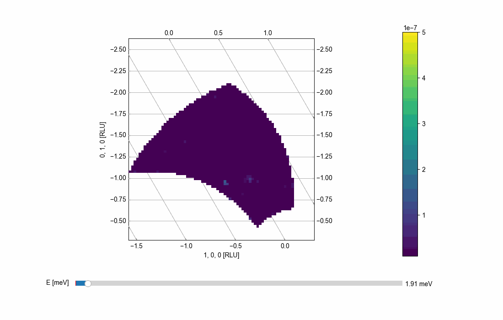

Advanced View3D tutorial
^^^^^^^^^^^^^^^^^^^^^^^^
Assuming that the Quick visualization from the Quick tutorials is understood, this tutorial seeks to introduce more advanced features for the 3D viewer object. As shown below, one can specify whether or not a grid is to be plotted with the key word arguments "grid". Further, the code below defines a function to create animations for the viwer object making use of of the 

.. code-block:: python
   :linenos:

   from matplotlib import animation
   import matplotlib.pyplot as plt
   import numpy as np
   # Turn of interactivity of figures (back-end dependend)
   plt.ioff()
   
   f = plt.figure()
   line = f.gca().plot([], [], lw=2)
   
   def View3DAnimator(V,name,folder,frames=None,keyFrame=None,fps=3):
   """Function to facilitate generation of animations for Viewer3D"""   
   
   if not frames is None:
       Frames = frames
       
       nFrames = len(Frames)
   
   def animate(i,correct=False):
       if not correct:
           I = Frames[i]
           print('{i} of {frames}'.format(i=i,frames=nFrames))
       else:
           I = i
       
       V.Energy_slider.set_val(I)
       return line
       
   
   if not frames is None:
       fig = V.ax.get_figure()
       anim = animation.FuncAnimation(fig, animate,
                                      frames=nFrames, interval=10, blit=True)
       anim.save(folder+name+'.gif', fps=fps,dpi=100,writer='imagemagick')
   
   if not keyFrame is None:
       fig = V.ax.get_figure()
       animate(keyFrame,correct=True)
       fig.savefig('figure0.png',format='png')
   
   plt.close(fig)   
   
   from MJOLNIR.Data import DataSet
   from MJOLNIR import _tools
   
   numbers = '161-169'
   # Load and convert data
   fileName = _tools.fileListGenerator(numbers,folder='/Path/To/Data/',year=2018)
   ds = DataSet.DataSet(dataFiles=fileName)
   ds.convertDataFile(saveFile=False)
   
   # Plotting data quickly in equi-sized voxels can be done by
   Viewer = ds.View3D(0.03,0.03,0.09,grid=9,rlu=True)
   #Generate the viewer with voxel size 0.03 1/AA x 0.03 1/AA x 0.05 meV, using
   # the key word grid, one toggles the regular grid but providing the input
   # as a number the zorder of the grid is specified (Data is plotted at 10).
   # It is also possible to plot data without making use of reciprocal lattice
   # units, chosen by rlu = True or False.
   Viewer.caxis=(1e-8,5e-7)
   nFrames = Viewer.Z.shape[-1] # Number of energy planes
   frames = np.arange(3,nFrames-3)
   frames = np.concatenate([frames,np.flip(frames[1:-1])]) # 
   # Generate animation as mp4 and create key frame as plane 75
   View3DAnimator(Viewer,'ViewerAnimationEPlane','/Path/To/Save/Folder/',frames=frames,keyFrame=75,fps=7)
   

With the above code a similar picture as shown in the simple tutorial is generated:

.. figure:: ViewerAnimationEPlane.png
  :width: 50%
  :align: center

The above is the key frame as created by the animation function and below is the animation itself:

All of this can of course also be generated for other directions than the Energy plane. Simply go into another plane by writing "Viewer.setProjection(0)" for plotting along the zeroth axis. 

.. note::
    As the plotting is generated by the use of the tentatively developed "matplotlib.gridspec" module some functionalities are not provided. Specifically, one cannot choose the positions of the tick marks. 

For further details about the RLU axis used to visualize the constant energy planes see the `RLU axis tutorial<../Tools/RLUAxis.html>`. As for the two other projections, these are created in a similar fasion but with only the horizontal axis being transformed as according to the projection along the corresponding vector. The energy axis is always kept trivially equal to the original axis and transforms under the identity. Further, the axis is simplified by always having the x and y coordinate axis perpendicular. Not everything is completely trivial as the hover-over tool tip becomes dependent on the plane chosen. This is dealt with by introducing a step corresponding to the plane. This is then taken into account when calculating the correct H, K, L, and energy position.