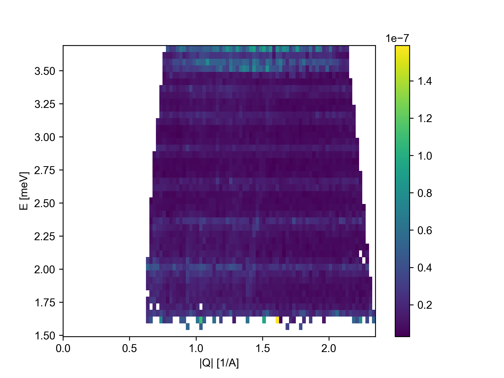
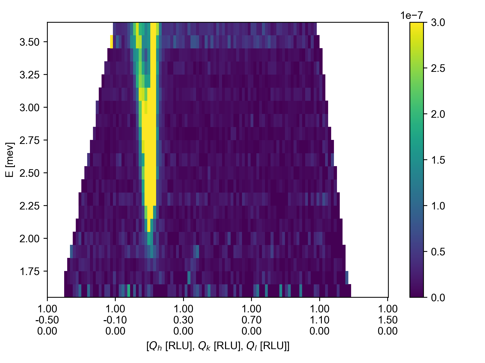
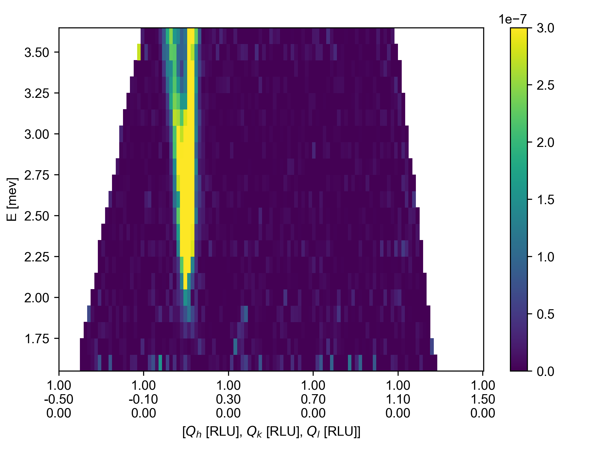
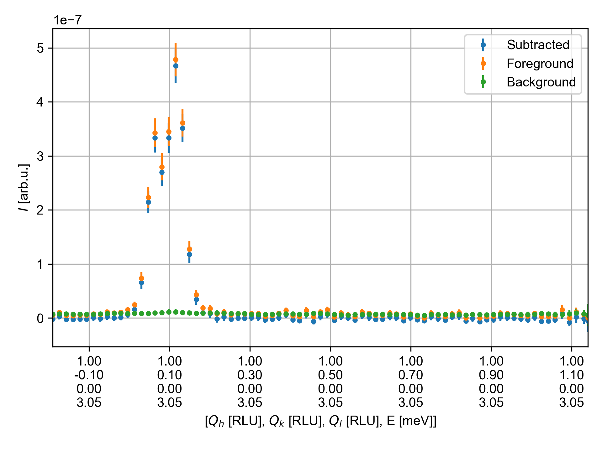
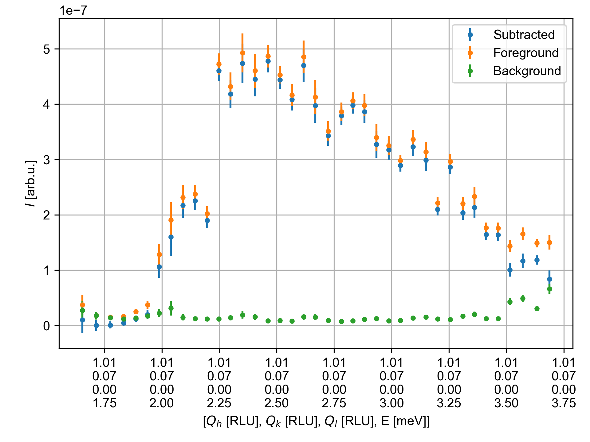

Background subtraction of YMnO3
^^^^^^^^^^^^^^^^^^^^^^^^^^^^^^^
In a dataset, not only the desired signal but also a lot of background points are often measured, which may initially seem wasteful. However, if we assume that the background from the sample environment, sample holder, and other general background sources is independent of the sample rotation (A3), then removing the regions of reciprocal space with a signal (hereafter denoted as foreground) will enable us to use all the remaining points to approximate the background. However, certain requirements need to be fulfilled. By integrating along A3, we end up with a background intensity that depends on |Q| and energy transfer. Sampling from this intensity gives us a powder-averaged background estimator. This method only works if the following points are true:

* The foreground intensity has a limited extend

* Enough reciprocal space has been measured

    - All \|Q\| and energy points must have some coverage

* Masks must be possible to create to remove the foreground

In the following example, we will use the data from YMnO3 to demonstrate how the background can be defined and help to subtract it from the signal.

 .. warning::
    If we do not remove all the foreground intensity and include it in the background calculation, we will end up over-subtracting the background
    esulting in negative scattering intensity. Negative intensities are a sign of oversubtraction, but they may also to some extend occur naturally due to counting uncertainties.
    The error bars for 1D cuts are propagated by estimating the root of errors added in quadrature.

.. code-block:: python
   :linenos:

   from MJOLNIR.Data import DataSet,Mask
   from MJOLNIR import _tools # Usefull tools useful across MJOLNIR 
   import numpy as np
   import matplotlib.pyplot as plt
   
   numbers = '136-137' # String of data numbers
   fileList = _tools.fileListGenerator(numbers,'/Path/To/Data/',2018) # Create file list from 2018 in specified folder
   
   ds = DataSet.DataSet(fileList)
   ds.convertDataFile()
   
   
   # Define masks to remove forground signal from the data set. For introduction
   # to masks see masking tutorial
   
   # Center is a little off...
   center = np.array([1.011,0.073])
   centerHKL = np.array([*center,0.0])
   radiusPoint = np.array([1.112,0.057])
   
   # Calculate to Qx Qy instead of HKL as data is from YMnO3, i.e. a hexagonal lattice
   centerQxQy = ds[0].sample.calculateHKLToQxQy(*center,0)
   radiusPointQxQy = ds[0].sample.calculateHKLToQxQy(*radiusPoint,0)
   BGMask = Mask.circleMask(centerQxQy,radiusPointQxQy,coordinates=['qx','qy'])
   
   
   
   # Generate background estimation from powder calculation
   # by only using data outside the background mask combined with the foreground mask.
   # Either provide the mask as a masking object or as a list of boolean arrays of size [df.I.shape for df in ds]
   
   ds.generateBackgroundModel(backgroundMask = BGMask, dQ = 0.025, dE = 0.05,
                          combineForegroundMask = True)
   
   # This will generate a background model located at ds.backgroundModel
   
   # To see if the model makes sense, the found intensities are plotted by
   ax = ds.backgroundModel.plotPowderAverage()
   ax.get_figure('figure0.png',format='png').savefig('/Path/To/Save/Folder/',format='png',dpi=300)
   
   # To use the background estimation let's perform a QE plot 
   Q1 = np.array([1.0,-0.5,0])
   Q2 = np.array([1.0,1.5,0])
   EMin = 1.6  
   EMax = 3.7
   dE = 0.1
   
   width = 0.05
   minPixel = 0.02
   
   # First the full data is plotted
   ax,*_data = ds.plotCutQE(q1 = Q1, q2 = Q2, EMin = EMin, EMax = EMax, dE = dE,
                        width = width, minPixel = minPixel, colorbar = True)
   ax.set_clim(0,3e-7)
   
   axSub,_dataSub, bins = ds.plotCutQE(q1 = Q1, q2 = Q2, EMin = EMin, EMax = EMax, dE = dE,
                        width = width, minPixel = minPixel,
                        backgroundSubtraction=True, colorbar = True)
   
   
   axSub.set_clim(0,3e-7)
   
   ax.get_figure('figure1.png',format='png').savefig('/Path/To/Save/Folder/',format='png',dpi=300)
   axSub.get_figure('figure2.png',format='png').savefig('/Path/To/Save/Folder/',format='png',dpi=300)
   
   # The background subtraction is also implemented on other methods, e.g. for 1D cuts
   
   Emin1D = 3.0
   Emax1D = 3.1
   
   # Either plot using two different calls, and a third for the background
   if False:
   ax1D, *_data1D = ds.plotCut1D(q1 = Q1, q2 = Q2, width = width, minPixel = minPixel, 
                                Emin = Emin1D, Emax = Emax1D, label='Original')
   
   ax1D,data1Dsub,bins = ds.plotCut1D(q1 = Q1, q2 = Q2, width = width, minPixel = minPixel, 
                                Emin = Emin1D, Emax = Emax1D, ax = ax1D, backgroundSubtraction = True,
                                label = 'Subtracted')
   
   
   # Plot also the background with the corresponding estimated error
   ax1D.errorbar(data1Dsub['BinDistance'],data1Dsub['Int_Bg'],data1Dsub['Int_Bg_err'],fmt='.', label='Background')
   
   else: # Or plot all three data set directly from the 1D cutting method
   ax1D,data1Dsub,bins = ds.plotCut1D(q1 = Q1, q2 = Q2, width = width, minPixel = minPixel, 
                                Emin = Emin1D, Emax = Emax1D, backgroundSubtraction = True,
                                label = 'Subtracted', plotForeground=True, plotBackground=True)
   
   
   ax1D.grid(True)
   ax1D.legend()
   
   ax1D.get_figure('figure3.png',format='png').savefig('/Path/To/Save/Folder/',format='png',dpi=300)
   
   
   ax1DE,data1DEsub,binsE = ds.plotCut1DE(q = centerHKL, width = width, minPixel = 0.05, 
                                E1 = EMin, E2 = EMax, backgroundSubtraction = True,
                                label = 'Subtracted', plotForeground=True, plotBackground=True)
   ax1DE.grid(True)
   ax1DE.legend()
   
   ax1DE.get_figure('figure4.png',format='png').savefig('/Path/To/Save/Folder/',format='png',dpi=300)
   

Above the data from YMnO3 was treated, but first a little background for the data.

Short Data Introduction
_______________________

The data only consist of twodata files taken in 2018 with a lower flux and a somewhat weak signal. Thus, intensities are of the order 5e-7 and the backgorund is quite low. The coverage is not too large and the alignment of the sample is a little off as seen in the masking where the centre of the dispersion was chosen to be at HKL = (1.011,0.073,0) and not the expected HKL = (1.0,0.0,0.0). In addition, a Currat-Axe spurion can be seen but has not been masked out for this case.

Background Generation and 2D cut
________________________________
Data treatment is done by first loading and converting the data as normally. Then, a set of background masks were defined to remove the foreground intensity and leave only parts of reciprocal space corresponding to background. The background model was then generated using the standard bin sizes (dQ = 0.02/AA and dE = 0.05 meV) resulting in the intensities plotted below. Next to the background estimation are the regular and background subtracted QE cuts. 

|pic1| |pic2| |pic3| 

1D Cuts
_______

Where this method is most useful is for 1D cuts where it is clearer if the plotted intensity is actually zero or has a finite value. Below is plotted a cut through the rather steep dispersion at (1.0,0.0,0.0) for a narrow energy window where foreground, background, and subtracted signal are shown. 

|pic4| |pic5|

Not Too much of a difference can be seen but the subtracted data follows the zero line neatly. Far more important is the background subtraction when performing energy cuts due to the presence of the constant energy stripes (To experimentally remove these see FAQ). A cut through the dispersion at HKL = (1.0,0.0,0.0) is performed and plotted similarly to the constant energy 1D cut.

 

