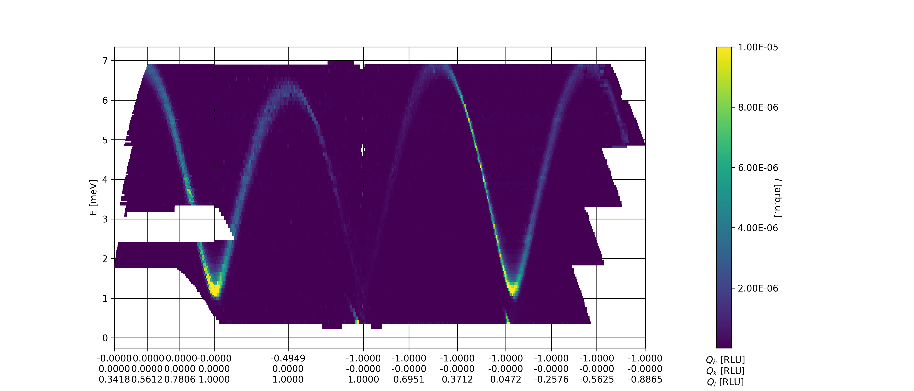
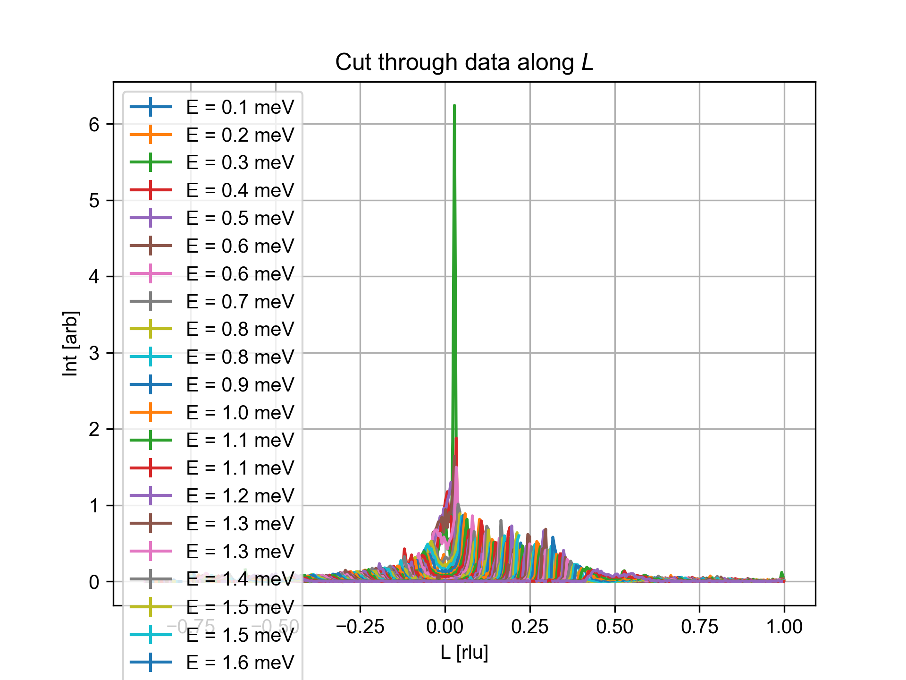

Advanced QE-cutting
^^^^^^^^^^^^^^^^^^^
With the simple show casing of the plotCutQELine in the `Simple plotCutQELine <../Quick/plotCutQELine.html>`_ tutorial the next step is to make use of all of the functionality of the method. That is, when performing cuts along different :math:`\vec{Q}` directions one might want different integration widths orthogonal to the direction, different bin sizes along :math:`\vec{Q}`, and different energy bins. All of this is possible through the use of kwargs.

.. code-block:: python
   :linenos:

   from MJOLNIR.Data import DataSet
   from MJOLNIR import _tools 
   import numpy as np
   import matplotlib.pyplot as plt
   
   numbers = '483-489,494-500' 
   fileList = _tools.fileListGenerator(numbers,'/Path/To/Data/',2018) 
   
   ds = DataSet.DataSet(fileList)
   ds.convertDataFile(saveFile=False)
   
   # Define the positions to be cut through
   Q1 = np.array([0,0,0])
   Q2 = np.array([0,0,1])
   Q3 = np.array([-1,0,1])
   Q4 = np.array([-1,0,-1])
   # Collect them into one array
   QPoints = np.array([Q1,Q2,Q3,Q4])
   
   # Define orthogonal width and minimum pixel size along Q-cut
   width = np.array([0.05,0.03,0.05]) # 1/AA
   minPixel = np.array([0.03,0.01,0.01]) # 1/AA
   
   # Define energy bins through the binEdges methods found in _tools
   Energies = np.concatenate(ds.energy,axis=0)
   EnergyBins = np.array([_tools.binEdges(Energies,0.04),
                      _tools.binEdges(Energies,0.1),
                      _tools.binEdges(Energies,0.07)])
   
   # Create figure into which the plot is made
   fig = plt.figure(figsize=(14,6))
   ax = fig.gca()
   
   ax,DataLists,BinListTotal,centerPositionTotal,binDistanceTotal = \
   ds.plotCutQELine(QPoints=QPoints, width=width, minPixel=minPixel, \
                ax=ax, EnergyBins=EnergyBins, ticks = 12,\
                vmin=1e-8, vmax=2.5e-5, tickRound = 4, plotSeperator = True,
                seperatorWidth=0.5,zorder=10)
   ax.grid(True,zorder=0,c='k')
   fig.savefig('figure0.png',format='png')
   
   # Plot a single cut through the data set
   
   fig2,ax2 = plt.subplots()
   segID = 2
   # Find all energies in segment
   E = np.array([x[0][-1] for x in centerPositionTotal[segID]])
   # Find index of energies corresponding to the list
   EnergyIndexes = [E.searchsorted(x) for x in np.linspace(1.5,6.5,5)]
   plot = 0
   for energyID in EnergyIndexes:    
   
   # Exctract corresponding line
   Counts = DataLists[segID][0][energyID]
   Monitor = DataLists[segID][1][energyID]
   Normalization = DataLists[2][segID][energyID]
   BinCounts = DataLists[segID][3][energyID]
   
   Intensity = np.squeeze(np.divide(Counts*BinCounts,Monitor*Normalization))*1e5
   Intensity_err = np.squeeze(np.divide(np.sqrt(Counts)*BinCounts,Monitor*Normalization))*1e5
   
   position = np.array(centerPositionTotal[segID][energyID]) # 4D array containing (H,K,L,E)
   Energy = np.mean(position[:,-1])
   
   ax2.errorbar(position[:,2],Intensity+len(EnergyIndexes)-plot,yerr=Intensity_err,fmt='-',label='E = {:.1f} meV'.format(Energy))
   plot+=1
   ax2.set_title('Cut through data along $L$')
   ax2.set_xlabel('L [rlu]')
   ax2.set_ylabel('Int [arb]')
   ax2.legend()
   ax2.grid(True)
   fig2.tight_layout()
   fig2.savefig('figure1.png',format='png')
   

Running the above code results in the following figure: 

Many different kwargs are possible for the cutting method and most of them should make obvious sense, but below is a table of arguments, their default value and their action for the plot. 

+----------------+---------------------------------------------------------------------------------+----------------+------+
|      Kwarg     | Action                                                                          | Default Value  | Unit |
+----------------+---------------------------------------------------------------------------------+----------------+------+
|      width     | Define the integration width orthogonal to cut direction                        | 0.1            | 1/AA |
+----------------+---------------------------------------------------------------------------------+----------------+------+
|    minPixel    | Minimal possible bin size along cut (using _tools.binEdges)                     | 0.01           | 1/AA |
+----------------+---------------------------------------------------------------------------------+----------------+------+
|       rlu      | Whether to use RLU or instrument positions                                      | True           | N/A  |
+----------------+---------------------------------------------------------------------------------+----------------+------+
|       fig      | Figure into which the axis is created                                           | None           | N/A  |
+----------------+---------------------------------------------------------------------------------+----------------+------+
|    dataFiles   | List of converted data files to be used                                         | None           | N/A  |
+----------------+---------------------------------------------------------------------------------+----------------+------+
|      vmin      | Minimal value used for the color scale                                          | min(Intensity) | N/A  |
+----------------+---------------------------------------------------------------------------------+----------------+------+
|      vmax      | Maximal value used for the color scale                                          | max(Intensity) | N/A  |
+----------------+---------------------------------------------------------------------------------+----------------+------+
|       log      | If the logarithm to the intensity is to be plotted (+1e-20)                     | False          | N/A  |
+----------------+---------------------------------------------------------------------------------+----------------+------+
|      ticks     | The number of tick marks to be plotted, minimum is len(QPoints)                 | 8              | N/A  |
+----------------+---------------------------------------------------------------------------------+----------------+------+
| seperatorWidth | Width of vertical line denoting change of cutting direction                     | 2              | pts  |
+----------------+---------------------------------------------------------------------------------+----------------+------+
|    tickRound   | Number of decimals to be used when creating tick marks                          | 3              | N/A  |
+----------------+---------------------------------------------------------------------------------+----------------+------+
|  plotSeperator | If a vertical black line is to be plotted to denote change of cutting direction | True           | N/A  |
+----------------+---------------------------------------------------------------------------------+----------------+------+
|   \*\*kwargs   | Additional kwargs are passed on to the pcolormesh method of Matplotlib          | None           | N/A  |
+----------------+---------------------------------------------------------------------------------+----------------+------+

Working with return data
------------------------

Having created the plot as wanted, the natural next step is to look at the actual data return from the method. This data is exactly the same as what would have been returned by utilizing the non-plotting version cutQELine with the same arguments (except for plotting specifics). Of most interest are the DataList, BinListTotal, and centerPositionTotal, containing the neutron, monitor, normalization, and binning counts as function of segment and bin, as well as the edges and centers of these bins. That is, DataList is a list of length 4 with

.. code-block:: python

  NeutronCounts, MonitorSum, NormalizationSum, BinningNumber = DataList

Each of these arrays has the length len(QPoints)-1, i.e. the number of cutting segments. Choosing one of these segments, the arrays are two dimensional with variable lengths. First axis is the energy index starting at lowest energy ending at the highest. In each of these arrays, the last dimension is along the :math:`\vec{Q}` direction starting closest to the left. The reason for variable lengths, depending on energy, is that each the method uses the _tools.binEdges method. This function tries to bin the provided values in an array with a minimal min size (further explained in `Tools tutorials <../Scripting.html#tools>`_). 

Concerning the bins, the two arrays BinListTotal and centerPositionTotal are in similair in build-up as the data lists. Actually, the centerPositionTotal has the exact same dimensions as the data, while BinListTotal (containing the boundaries of the bins) is one longer in both the energy and binning along the :math:`\vec{Q}` cut direction. That both are available is due to the requirements of the plotting method pcolormesh. 

As an example, the intensities as function of :math:`L` for the third segment at five different energies are plotted. 

Each energy is shifted by 1 for clarity. As the intensity of the signal is a combination of many different aspects an overall factor of 1e5 is multiplied to it as to ensure that the numbers are in a reasonable range. In the data the instrumental in-focus and out-of-focus effects are visible as the peak at possitive :math:`L` are a lot sharper and narrower than the ones at negative :math:`L`. This is as expected from a standard measurement. 