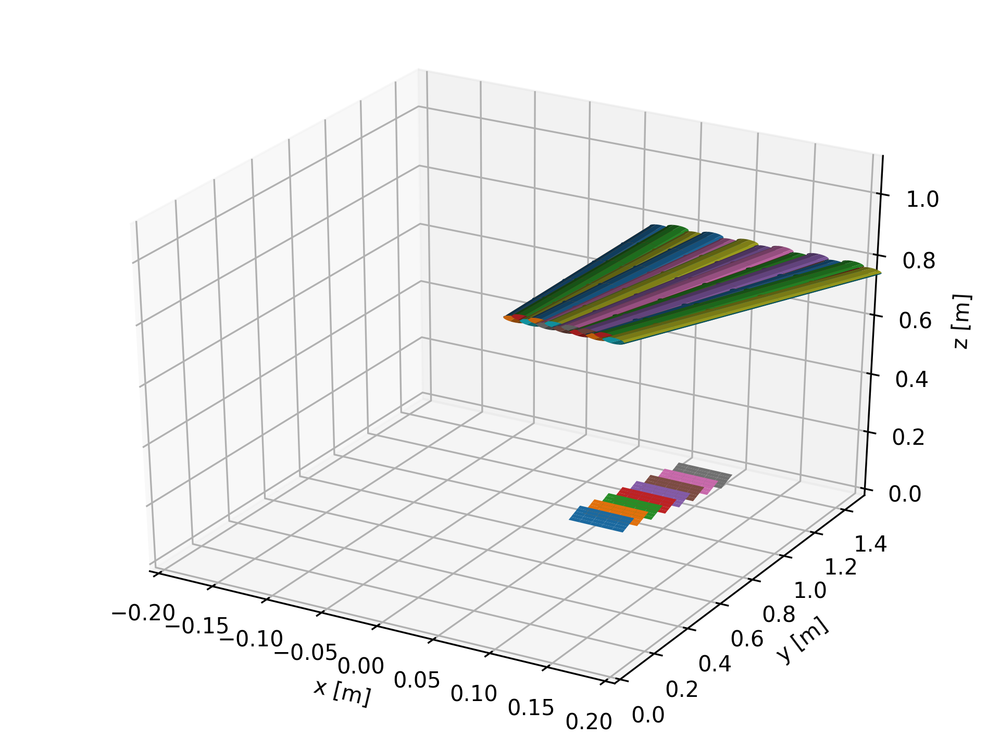
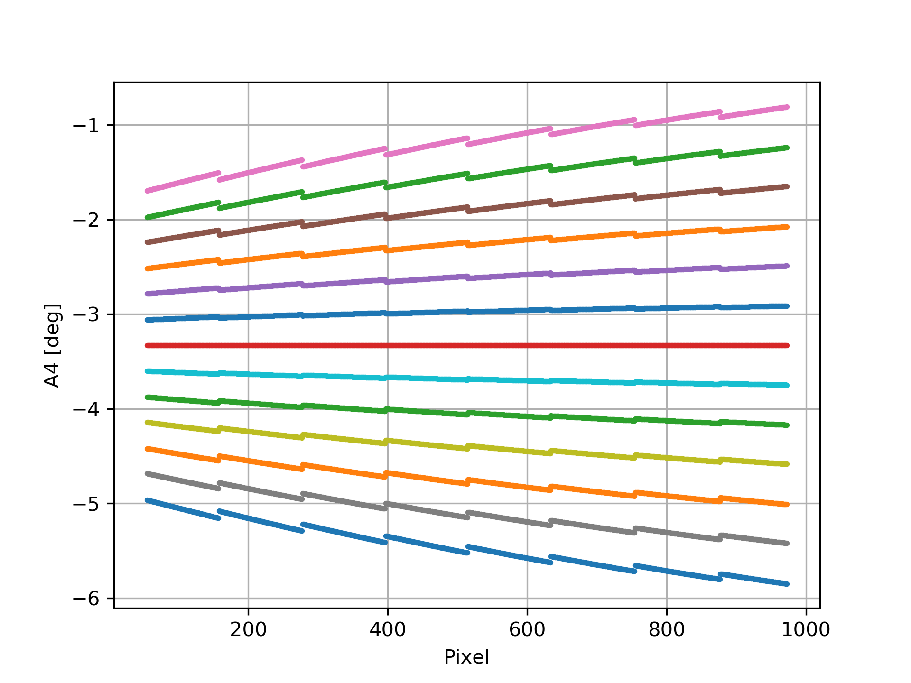

Load instrument from XML file
^^^^^^^^^^^^^^^^^^^^^^^^^^^^^
Instead of creating an instrument from scratch every time in python, as explained in the `Instrument <instrument.rst#Build-simple-instrument>`__ tutorial, one can instead load an instrument through the XML interface. An example of such a file is shown below:

.. literalinclude:: SimpleInstrument.xml 
   :language: xml 
   :linenos:

One starts with the instrument and gives some informations. Next level is the wedge where position and concept is provided. For each wedge, one specifies the analysers with their positions,  direction of surface, d-spacing, mosaicity, width and height, and afterwards the detectors. These are specified with position, direction along which the tube extends, number of pixels, length and diameter of tube, how the pixels are split into segments (only applicable if concept "ManyToMany" is used).

.. code-block:: python
   :linenos:

   from MJOLNIR.Geometry import Instrument
   import matplotlib.pyplot as plt
   import numpy as np
   Instr = Instrument.Instrument(fileName=SimpleInstrument.xml) # Load XML file
   
   
   fig = plt.figure() # Create 3D figure
   ax = fig.gca(projection='3d')
   
   Instr.plot(ax) # Plot instrument
   
   ax.set_ylim(0.0,1.5)
   ax.set_xlim(-0.2,0.2)
   ax.set_zlim(0.0,1.1)
   ax.set_xlabel('x [m]')
   ax.set_ylabel('y [m]')
   ax.set_zlabel('z [m]')
   plt.tight_layout()
   
   plt.savefig('figure0.png',format='png')
   
   Instr.initialize() # Initialize instrument
   
   plt.figure()
   for det in range(len(Instr.wedges[0].detectors)):
   start,stop = Instr.wedges[0].detectors[det]._split[[0,-1]]
   plt.scatter(np.arange(start,stop),#range(Instr.wedges[0].detectors[det].pixels),
               Instr.A4[0][det]*180.0/np.pi,zorder=10,s=3)
   
   plt.grid(True)
   plt.xlabel('Pixel')
   plt.ylabel('A4 [deg]')
   plt.savefig('figure1.png',format='png')
   
   plt.figure()
   for det in range(len(Instr.wedges[0].detectors)):
   start,stop = Instr.wedges[0].detectors[det]._split[[0,-1]]
   plt.scatter(np.arange(start,stop),
               Instr.Ef[0][det],zorder=10,s=3)
   
   plt.grid(True)
   plt.xlabel('Pixel')
   plt.ylabel('Ef [meV]')
   plt.tight_layout()
   
   plt.savefig('figure2.png',format='png')
   

Most of the above code is in reality only plotting commands for the instrument and the calculated A4 and Ef values.

Instrument generated from XML file. Currently, the figure is rendered wrongly due to a visualization problem... 

Corresponding A4 values as calculated from instrument. Here it is seen that the A4 values are energy dependent if one has radial detectors that are "non-optimally" placed with respect to the analyser. Only the central detector tube has the same A4 value independent of position.
 .. figure:: SimpleInstrument2_Ef.png
  :width: 50%
  :align: center

Energies as calculated. With this setup of analysers and detectors there is a whole lot of energy coverage for all of the segments. This is not what will happen in a real experiment as all of the segments have "inactive" ends that are cut of. However, some overlap remains.