Normalization inspection
------------------------

Inspection of the current normalization table used to convert the raw data measured into actual scattering intensities is of great importance. It holds the information of energy and A4 value of all of the individual pixels and does thus govern the convertion into reciprocal space. Furthermore, it contains the normalization needed to take care of detector sensitivity, space angle coverage, as well as analyser efficiency. Due to this vital role, it has been made possible to easily plot the contents of the calibration table.

The script *CalibrationInspector.py* and it has the following help text::

    $ python CalibrationInspector.py -h
    usage: CalibrationInspector.py [-h] [-s SAVE] [-p [PLOTLIST [PLOTLIST ...]]]
                                   [-b BINNING]
                                   [DataFile]

    Inspection tool to visialize calibration tables in a data file.

    positional arguments:
      DataFile              Data file from which calibration table is to be
                            plotted. If none provided file dialog will appear.

    optional arguments:
      -h, --help            show this help message and exit
      -s SAVE, --save SAVE  Location to which the generated file will be saved.
      -p [PLOTLIST [PLOTLIST ...]], --plot [PLOTLIST [PLOTLIST ...]]
                            List of wanted plots to be generated. Should be
                            "A4","Normalization","Ef","EfOverview". Default "A4".
      -b BINNING, --binning BINNING
                            Binning to be inspected. Default '8'

First of all, if the program is run without any arguments, a file dialog will appear asking for a file to be plotted. From this file, the default plots will be created and the file directory is saved in an external settings file such that next time the program is run the file dialog will open on this location.

As seen in the description, the user can choose which plots are to be generated and whether to save the results or simply inspect them visually. As a default the script uses the 8 pixel binning and creates an A4 plot. 
This can be changed by invoking the *-b binning* or *-p PlotType* flags for binnning and plotting respectively. The binning choosen should as one of the provided in the file (usually 1, 3, or 8), and the plotting possibilities are "A4","Normalization","Ef", and "EfOverview".

Providing a saving location with the use of the *-s savelocation* or *--save savelocation* makes the script save the figures in the corresponding path. It should be a directory and not a file path. 
The figures are saved with selfexplanartory titles in a png format such as they can be opened on all OS's without problems.

Example
-------

An example of the four different figures produces is the following, when choosing binning 1, 3, and 8:

Binning 1:

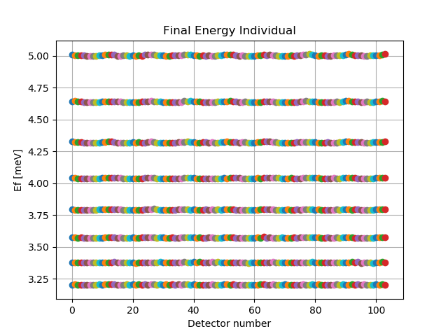

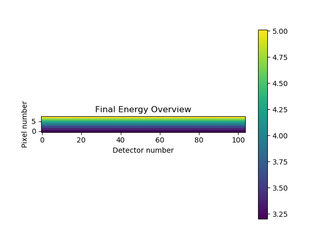

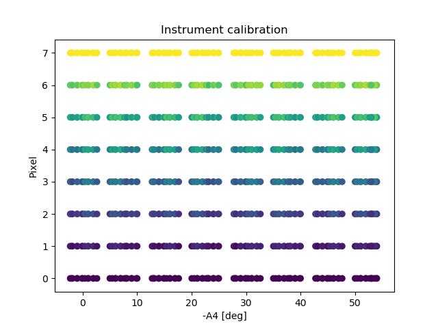

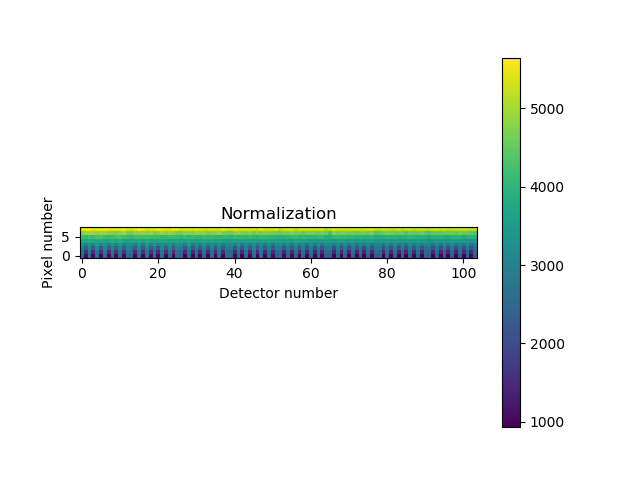

Binning 3

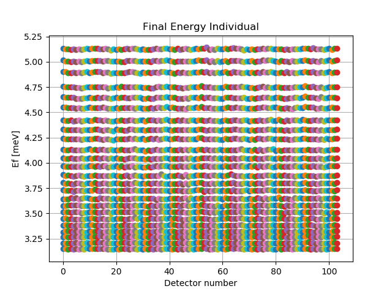

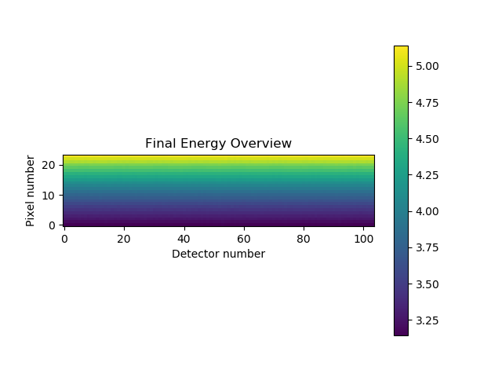

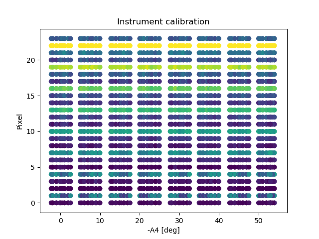

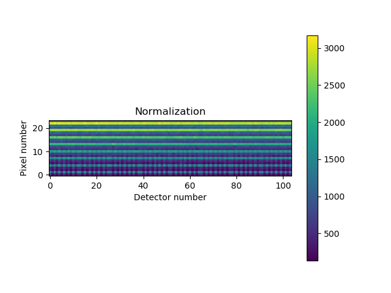

Binning 8

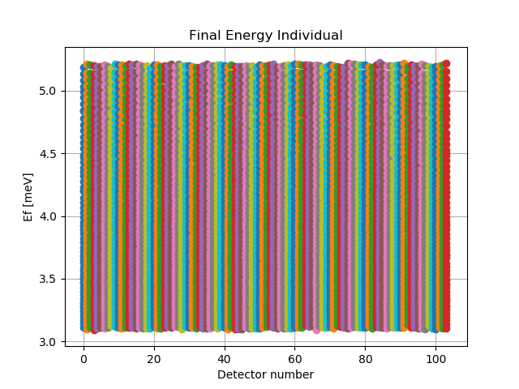

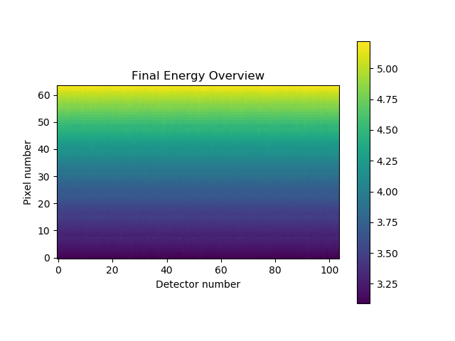

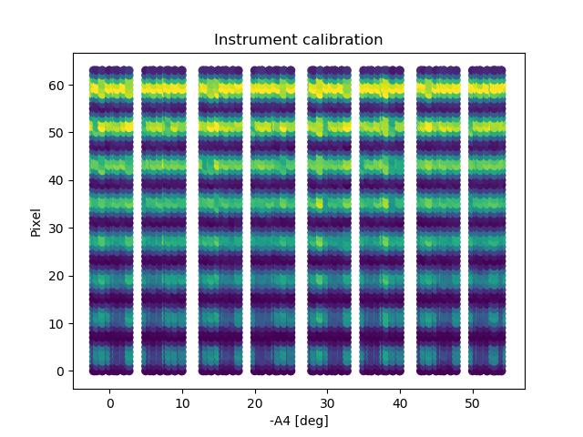

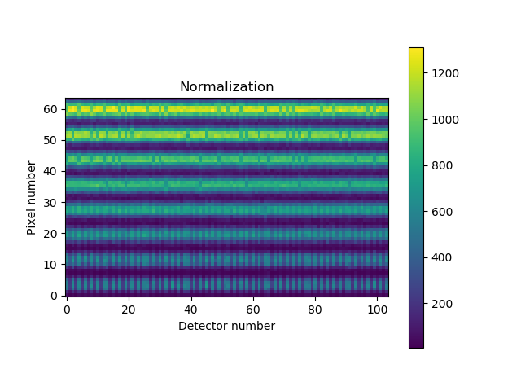

