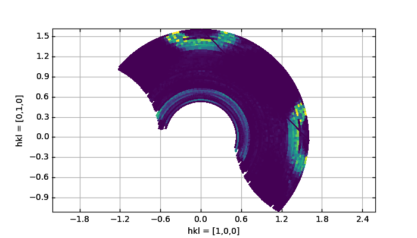
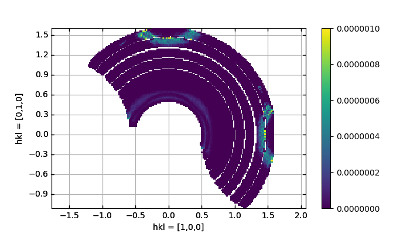

Plotting of Q plane using binnings
^^^^^^^^^^^^^^^^^^^^^^^^^^^^^^^^^^

 .. literalinclude:: ../../Tutorials/PlotQPlane.py
     :lines: 4-  
     :language: python
     :linenos:

Creation of two plots of the cameasim2018n000011 converted data. Firstly, a polar plot is created on a reciprocal lattice axes, with adaptive bins and non-logarithmic intensities. Notice that in line 14 the coloring is changed with the added method to the axes object.

.. _PlotQPlane_fig1: 

Plotting of intensities measured between ~5 meV and ~5.75 meV using adaptive polar binning.

.. _PowderPlot_fig2: 

Plotting of intensities measured between ~5 meV and ~5.75 meV using equi-sized rectangular binning. As the binning is chosen too fine a lot of holes appear in the plot.

