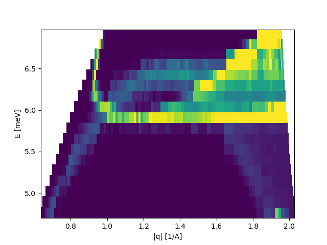

Powder cutting and visualization
^^^^^^^^^^^^^^^^^^^^^^^^^^^^^^^^
When having a converted data file of a powder sample, one might be interested in the powder signal instead of the (qx,qy) intensities. These can both be found and plotted by using the cutPowder and plotCutPowder methods of the DataSet object. The three different calls below all produce the same data treatment, i.e. intensity, monitor, normalization, and normalization count as a function of length of q and energy transfer. It has been choosen, with the use of qMinBin=0.01 and tolerance=0.125 that the length of q and the energies are binned with minimum sizes 0.01 1/A and 0.125 meV.

 .. literalinclude:: ../../Tutorials/Powder.py
     :lines: 5-31,35-
     :language: python
     :linenos:

Notice in line 21 the call to the axis object chaning all of the c-axis for the figure. This method has been added in the plotting routine to ease the change of intensity as the plot consists of many constant energy plots. Furthermore, when hovering over a pixel in the plot, the q length, energy and intensity of the nearest pixel center is shown. This is to make the binning size somewhat transparent and also ensure that the user sees the current value of the pixel, and not an interpolation.

.. _PowderPlot_fig1: 

.. figure:: ../../Tutorials/Powder.png
   :width: 45% 

Figure created by the DataSet method plotCutPowder showing a phonon dispersion as well as a spurious signal.

.. _PowderPlot_fig2: 

Figure created by the function plotCutPowder showing the same data but with the c-axis changed.

