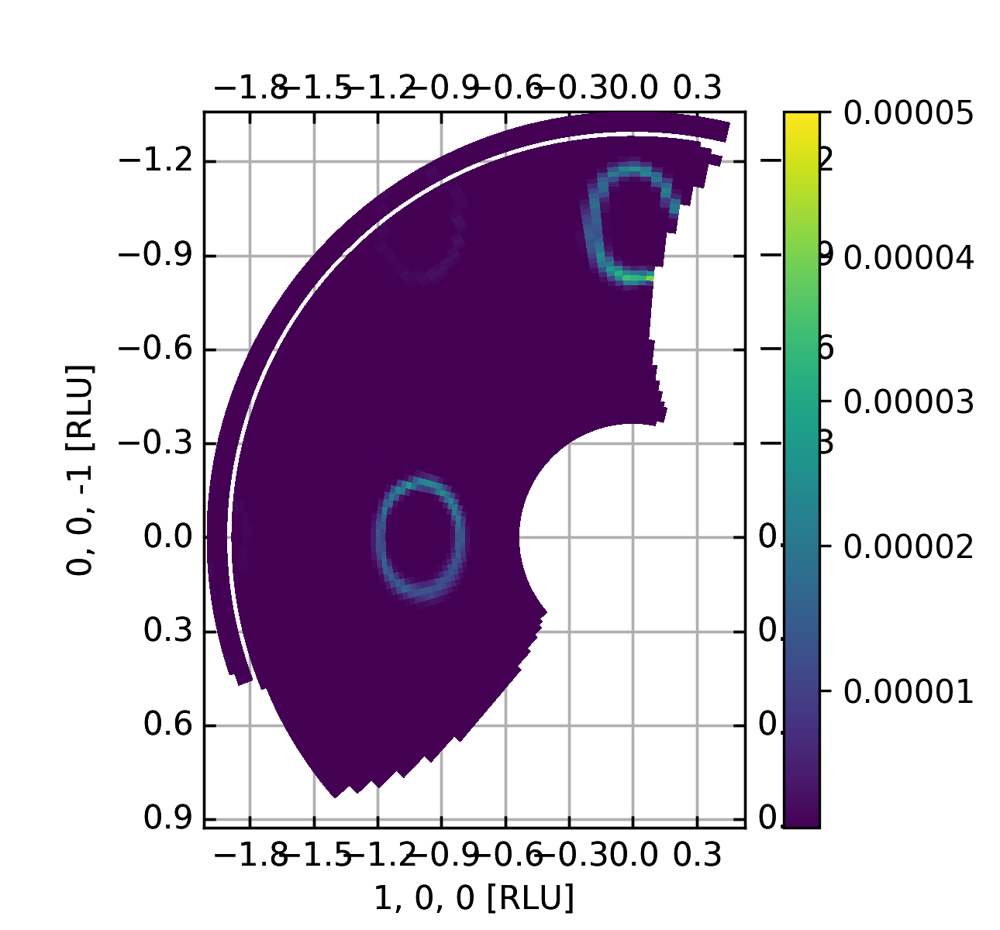
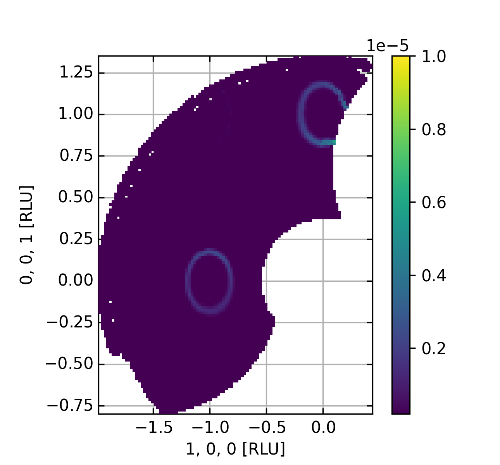

Plotting a Q plane for constant energy
^^^^^^^^^^^^^^^^^^^^^^^^^^^^^^^^^^^^^^
After one has gotten an overview of the data measured through the Viewer3D (explained in `<QuickView3D.html>`_ the next step is to plot only as single plane of constant energy as function of H, K, and L or :math:`Q_x` and :math:`Q_y` depending on the boolean state of the "rlu" key word argument. Two different binning methods are currently provided: Polar and XY. What is done is that the points measured are binned either. For explanation of units and size of bins, see below

.. code-block:: python
   :linenos:

   from MJOLNIR.Data import DataSet
   from MJOLNIR import _tools # Usefull tools useful across MJOLNIR 
   import numpy as np
   
   numbers = '483-489,494-500' # String of data numbers
   fileList = _tools.fileListGenerator(numbers,'/Path/To/Data/',2018) # Create file list from 2018 in specified folder
   
   # Create the data set
   ds = DataSet.DataSet(fileList)
   ds.convertDataFile(saveFile=False)
   mask = np.zeros_like(ds.I.data) # Define mask, see FAQ for explanation
   mask[:,:,:3]=True
   ds.mask = mask
   
   # Choose energy limits for binning
   EMin = 3.5
   EMax = 4.0
   # Generate a figure making use of binning in polar coordinates
   Data,Bins,ax = ds.plotQPlane(EMin=EMin, EMax=EMax,xBinTolerance=0.03,yBinTolerance=0.03,binning='polar',vmin=2e-7,vmax=2e-5)
   
   fig = ax.get_figure() # Extract figure from returned axis
   fig.colorbar(ax.pmeshs[0]) # Create colorbar from plot
   ax.set_xlim(-2.6,0.68)
   ax.set_ylim(-1.76,2.58)
   fig.set_size_inches(4.3,4)
   fig.savefig('figure0.png',format='png')
   
   # Generate a figure making use of binning in regular orthonormal coordinates
   Data2,Bins2,ax2 =  ds.plotQPlane(EMin=EMin, EMax=EMax,xBinTolerance=0.03,yBinTolerance=0.03,binning='xy',vmin=5e-7,vmax=5e-5)
   
   fig2 = ax2.get_figure()
   fig2.colorbar(ax2.pmeshs[0])
   fig2.set_size_inches(4.3,4)
   fig2.savefig('figure1.png',format='png')
   

The above code creates the two figures shown below. The difference between the two is that the former performs the creation of bins in polar coordinates. This means that the provided bin tolerances are to be understood as the angular and radial bin sizes respectively for x and y. If the rlu is set to true the units are in projections along the in plane scattering vectors. Otherwise units are in 1/AA.

|pic1| |pic2|

For further examples and the usage of 3D axis in this method, see `Plotting Q planes for constant energy <../Advanced/ConstantEnergy.html>`_.

Binnings explained
------------------

The bin sizes depends on the other parameters provided to the method. The tables below seeks to show all of the possibilities:

+-------------------------+---------------+------+----------------------+---------------------------+
| Binning with rlu==False | Name          | Unit | Limits               | Explanation               |
+-------------------------+---------------+------+----------------------+---------------------------+
| XY                      | xBinTolerance | 1/AA | (0, :math:`\infty` ) | Binning along :math:`Q_x` |
+-------------------------+---------------+------+----------------------+---------------------------+
| XY                      | yBinTolerance | 1/AA | (0, :math:`\infty` ) | Binning along :math:`Q_y` |
+-------------------------+---------------+------+----------------------+---------------------------+
| Polar                   | xBinTolerance | rad  | (0, :math:`2\pi` ]   | Angular binning           |
+-------------------------+---------------+------+----------------------+---------------------------+
| Polar                   | yBinTolerance | 1/AA | (0, :math:`\infty` ) | Radial binning            |
+-------------------------+---------------+------+----------------------+---------------------------+

With the rlu==True shown below, it is assumed that data is plotted in the RLU axis container.

+------------------------+---------------+------+----------------------+---------------------------------+
| Binning with rlu==True | Name          | Unit | Limits               | Explanation                     |
+------------------------+---------------+------+----------------------+---------------------------------+
| XY                     | xBinTolerance | N/A  | (0, :math:`\infty` ) | Binning along first projection  |
+------------------------+---------------+------+----------------------+---------------------------------+
| XY                     | yBinTolerance | N/A  | (0, :math:`\infty` ) | Binning along second projection |
+------------------------+---------------+------+----------------------+---------------------------------+
| Polar                  | xBinTolerance | rad  | (0, :math:`2\pi` ]   | Angular binning                 |
+------------------------+---------------+------+----------------------+---------------------------------+
| Polar                  | yBinTolerance | N/A  | (0, :math:`\infty` ) | Radial binning                  |
+------------------------+---------------+------+----------------------+---------------------------------+

For further explanation of the RLU axis see `Reciprocal Lattice Unit Axis <../Tools/RLUAxis.html>`_.