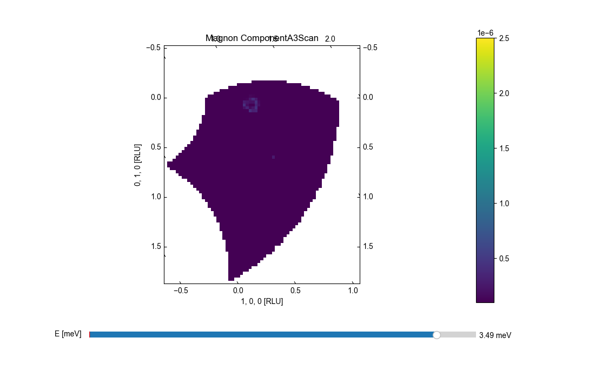
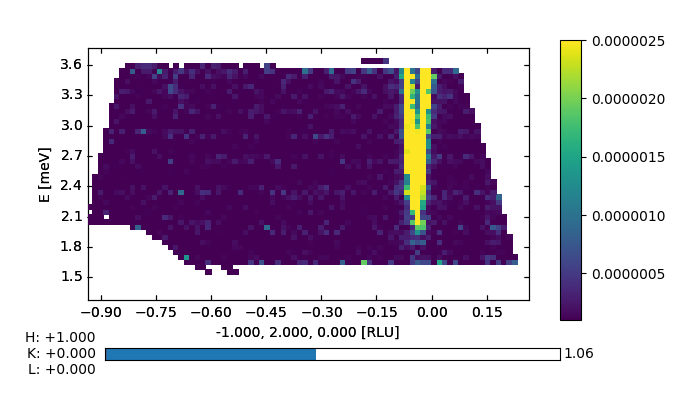

Viewer3D
========

In this section, the interactivity of the Viewer3D is explained. 
It is assumed that an instance has already been create (for example, see `Quick plotting of data <QuickView3D>`_). 
For a given data set, the viewer will look something like the picture below:

|pic1| |pic2|

When initiated, the viewer defaults to showing the normalized scattering intensity in a constant energy plane with the 
reciprocal lattice vectors as coordinates. That is, from the data file the viewer extracts the scattering plane and the two 
simplest axis orthogonal to one another with the vector closest to the [H,0,0] axis as axis 0, for example:

In a tetragonal crystal with scattering plane [H,0,L]:
 - Axis 0 [H,0,0]
 - Axis 1 [0,0,L]

This is of course because the two vectors are by definition orthogonal to each other and [H,0,0] is closest to the [H,0,0] direction.

For a non-orthogonal system like a hexagonal crystal in the [H,K,0] scattering plane, the two vectors choosen will be:
 - Axis 0: [H,0,0]
 - Axis 1: [-H,2K,0]

Interactivity
-------------
As 3D data by construct is difficult to present the interactivity of the viewer is its main trait. As described above, one has access to three different axis 
being the two projections in :math:`\vec{Q}` and energy. The data is always plotted as a function of two of these and the third axis can be stepped through. 

+-----------------+------------------------------------------------------+
|    Key press    | Effect                                               |
+-----------------+------------------------------------------------------+
|        0        | Chang plotting such that projection 0 is constant    |
+-----------------+------------------------------------------------------+
|        1        | Chang plotting such that projection 1 is constant    |
+-----------------+------------------------------------------------------+
|        2        | Chang plotting such that energy is constant          |
+-----------------+------------------------------------------------------+
|  \+ or UpArrow  | Increment step along constant axis                   |
+-----------------+------------------------------------------------------+
| \- or DownArrow | Decrement step along constant axis                   |
+-----------------+------------------------------------------------------+
|        s        | Save current figure                                  |
+-----------------+------------------------------------------------------+
|       End       | Skip to the end of allowed stop in this projection   |
+-----------------+------------------------------------------------------+
|       Home      | Skip to the start of allowed stop in this projection |
+-----------------+------------------------------------------------------+

In addition to the key presses tabulated above, hovering with the mouse above a point on the plot creates a tool-tip with the current :math:`\mathrm{H}, \mathrm{K}, \mathrm{L}` point 
and energy. Scrolling with the mouse wheel has also been incorporated to increments or decrements the current step. Further, left-clicking writes these data to the command line console which are then intended to be used when cutting the data using the other methods 
presented in both the Quick and Advanced tutorial sections.

Technical reasonings
--------------------
When choosing to plot data in the reciprocal lattice system what is happening behind the scence is that the data set in the 4D space, :math:`\vec{X}=\left(\mathrm{H},\mathrm{K},\mathrm{L},\mathrm{E}\right)` is 
projected along two scattering vectors in the scattering plane (described above), and the energy axis. That is, one transform into the relevant 3D sub-space. 
Here, the data is binned using the SciPy HistogramDD into equi-sized voxels with sizes given by the inputs. One thus has a "3D cube" of bins which can easily be cut along
the major axis (:math:`x, y, z`), which in crystal space are the two projection vectors and energy. This does require the two projection vectors to be orthogonal which 
in general is not possible for the simplest vectors in RLU. Thus the two projection vectors are choosen to be a suitable linear combination. If the two vectors happens to 
be simply two major axis in the RLU wich equal length one does not have to think of if the data is skewed when plotted. However, this does not happen very often, and 
the measured area by the instrument will be heavily distorted and skewed. This is countered by plotting in a non-orthogonal curve-linear axis (provided by the development branch of Matplotlib). 
This axis differentiates between the coordinate set of the data and the coordinate set of the plot by means of general functions. For our purposes the two are connected 
by the projection vectors and in principle one transform the :math:`\mathrm{H}, \mathrm{K}, \mathrm{L}` data points from projected (2D) coordinates back to 3D :math:`\mathrm{H}, \mathrm{K}, \mathrm{L}` 
to the instrument :math:`\mathrm{Q}_x, \mathrm{Q}_y` coordinates. 
Thus, what is obtained is an axis where intensity is plotted with the shape of the :math:`\mathrm{Q}_x, \mathrm{Q}_y` through the coordinates of the projections in units of 
:math:`\mathrm{H}, \mathrm{K}, \mathrm{L}`. 

A small further detail to be noted is the natural off set in :math:`A_3` originating from the arbitrary definition of zero for :math:`A_3`. This is taken into account before 
data is projected along the projection vectors, but not when plotting directly in the instrument system (:math:`\mathrm{Q}_x, \mathrm{Q}_y`). 

All of the above projectioning is not relevant when choosing to plot in the instrument system (:math:`\mathrm{Q}_x, \mathrm{Q}_y`) as questions like orthogonality and skew of 
basis are irrelevant.