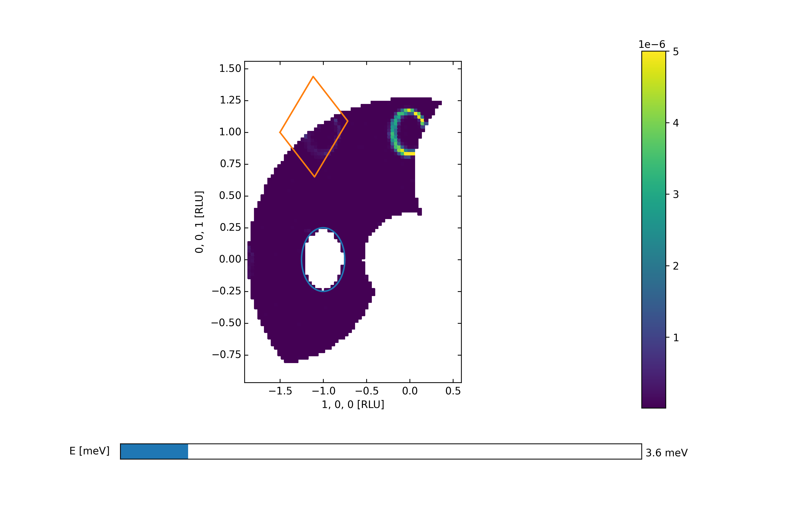
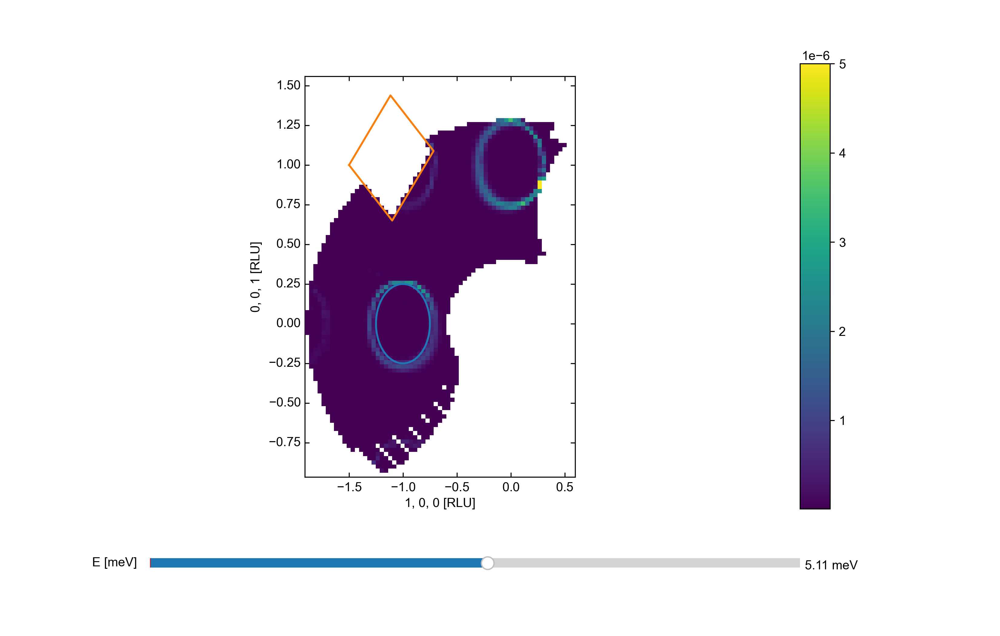
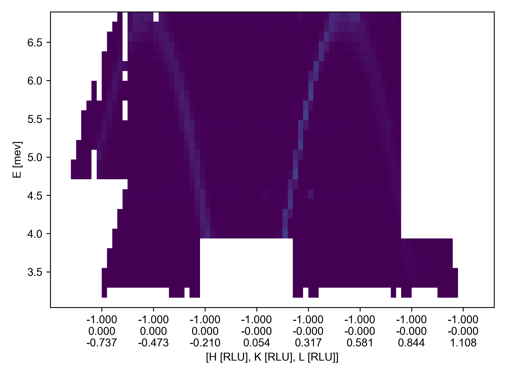

Masking of Data files
^^^^^^^^^^^^^^^^^^^^^
After an experiment has been performed, there are usually some parts of the data that contain noise or background. Whether these parts are spurious signals or well established background does not play an important role. In order to mask them out, a set of masks have been created, covering masks in 1D, 2D and 3D. Due to the ambiguity in definint e.g. a box in 3D, it is adventageous to generate a mask for then to plot it in an axes. This can be done either in 2D or 3D as needed, but notice that 1D masks are not plotable. 

The following masks are available:

+---------------+----------------+---------------------------------------------------------------------------------+
| Mask          | Dimensionality | Description                                                                     |
+===============+================+=================================================================================+
| lineMask      |       1D       | Mask between two values                                                         |
+---------------+----------------+---------------------------------------------------------------------------------+
| indexMask     |       1D       | Mask between two indices along the provided axes                                |
+---------------+----------------+---------------------------------------------------------------------------------+
| circleMask    |       2D       | Mask values inside of circle defined by center and a point on the circumference |
+---------------+----------------+---------------------------------------------------------------------------------+
| rectangleMask |       2D       | Mask a rectangular area given two or three points                               |
+---------------+----------------+---------------------------------------------------------------------------------+
| boxMask       |       3D       | Mask a box defined by three or four points                                      |
+---------------+----------------+---------------------------------------------------------------------------------+
| indexmask     |       N/A      | Maks specific indices along one axis                                            |
+---------------+----------------+---------------------------------------------------------------------------------+

When a mask is generated, one can specify the coordinates in which the masking is to take place. Usually, this is going to be the "h", "k", "l", and "energy" axis of the data, but others are also supported. This also means that plotting the mask on to of the data provides some difficulty. This is the reason behind the "transformation" argument of the plot method. It takes a function as input which converts between the choosen coordinates and the plotted ones; an example will be shown below.

Most often, masking is to be performed in many coordinates that might depend on each other. This could be masking Bragg peaks, where the position is known in (h,k,l) but only for a limited energy range. This means that masks are to be merged either using a boolean "and" or "or" command.

Commands to combine masks: 

- "*": AND, requires both masks to be true for region to be masked
- "+": OR, requires either masks to be true for region to be masked
- "/": AND NOT, requires first mask to be true while second is false to mask region
- "-": OR NOT, requires first mask to be true or second mask to be false to mask region

These algebraic operators also have a given order of operation making it easier to construct more complicated mask combinations. In addition to these two operations, their negated variants also exists: "/" means "Nan" and "-" means "Nor". 

Combining any two masks generates a multiMaks object that simply wraps the two masks together. It has both a plotting and a calling method taking care of the needed addition of multiple masks.

.. code-block:: python
   :linenos:

   from MJOLNIR.Data import DataSet,Mask
   from MJOLNIR import _tools # Usefull tools useful across MJOLNIR 
   import numpy as np
   import matplotlib.pyplot as plt
   
   numbers = '494-500' # String of data numbers
   fileList = _tools.fileListGenerator(numbers,'/Path/To/Data/',2018) # Create file list from 2018 in specified folder
   
   ds = DataSet.DataSet(fileList)
   ds.convertDataFile()
   
   # Define circular mask at -1 0 0 in hkl with radius 0.25
   circle = Mask.circleMask(center=[-1,0],radiusPoint=[-1.25,0],coordinates=['h','l']) # only provide h,l
   # The circle mask is only to be on when energy is between 3.0 meV and 4.0 meV
   lowEnergy = Mask.lineMask(start=3.0,end=4.0,coordinates='energy')
   
   # Mask dispersion above -1 0 1 with a rectangle
   corner1 = np.array([-1.5,1.0]) # in h,l     (k=0.0)
   corner2 = np.array([-1.1,0.65]) # in h,l
   corner3 = np.array([-0.5,0.9]) # in h,l
   
   rectangle = Mask.rectangleMask(corner1,corner2,corner3,coordinates=['h','l'])
   # but only for energies not between 3.0 and 4.0, which is achieved by negating lowEnergy
   
   # the total mask then becomes
   mask = circle*lowEnergy+rectangle*lowEnergy.bar()
   
   # Apply the mask
   ds.mask = mask
   
   # Generate a 3d viewer
   view = ds.View3D(0.05,0.05,0.05)
   # it is started in the hkl plane, where we can also plot our masks.
   # However, the transformation used by view3D is from qx,qy to hkl, so the inverse
   # is to be provided. This is stored in
   trans = view.ax.sample.inv_tr
   
   mask.plot(view.ax,transformation=trans,zorder=20)
   
   # tune the colorbar
   view.caxis=(1e-8,5e-6)
   
   view.Energy_slider.set_val(10)
   view.ax.get_figure('figure0.png',format='png').savefig('/Path/To/Save/Folder/',format='png',dpi=300)
   view.Energy_slider.set_val(40)
   view.ax.get_figure('figure1.png',format='png').savefig('/Path/To/Save/Folder/',format='png',dpi=300)
   
   # Along the Q-E direction the masking looks differently
   QPoints = np.array([[-1.0,0.0,-1.0],
                   [-1.0,0.0,1.25]])
   Energies = np.concatenate(ds.energy,axis=0)
   EnergyBins = np.linspace(np.min(Energies),np.max(Energies),31)
   ax,*_ = ds.plotCutQELine(QPoints=QPoints, width=0.05, minPixel=0.05, \
               EnergyBins=EnergyBins)
   
   # Change the colorbar of the plot
   ax.set_clim(0,2e-5)
   
   ax.get_figure('figure2.png',format='png').savefig('/Path/To/Save/Folder/',format='png',dpi=300)
   

The end result of applying these masks is shown below.

|pic1| |pic2| |pic3| 

Combining masks
###############

Masking has been implemented into MJOLNIR in such a way, that one can combine masks rather freely. With the above list of possible masks as building blocks, it is believed that almost all masks can be generated by combining the masks with the correct arithmatic operations. Masks are combined using the standard order of operators, meaning that AND (*) operations are performed befor OR (+). In additionally, parentheses are allowed making it easier to perform more advanced mask combinations, where multiple masks are to be negated or AND'ed with another masks. This complexity also allows for situations where multiple combinations are equivalent. Using the masks defined in the example, then 

.. math::

    (circle*lowEnergy).bar() = circle.bar()*lowEnergy.bar()

Behind the sence, a pair-wise tree is created by multiMasks and all operations are propagated through this tree, remembering the mask relations. 

General features
################

All of the masks are build on a common base object with a set of methods. In detail, these methods are ensure by the use of a meta class, but the exact implementation is out of scope. What is ensured is that all masks have a *__call__* and a *plot* method. The *_call__* method is used to generate the mask needed in MJOLNIR, and depending on the attributes used to generate a mask it either takes coordinates with the correct dimensionality or an object with attributes matching the coordinates given to the mask. The *plot* method takes a *matplotlib.axes* object and, if applicable, a transformation function. This transform is needed when plotting masks on axis having other coordinates than the ones provided to the masks, or if the axis utilizes some sort of transformation under the hood. Unfortunately, this is often the case for MJOLNIR, where *RLU*, and other axes are used. In the above example, where the masks were to be plotted on an *RLU* object, the transformation from (h,l) to (qx,qy) was to be specified. This is found as an method on the *ax.sample* object. Plotting of masks on axes is currently in a non-optimal state... Best way of achieving the goal is to find an example, as above, or simply write the maintainer.

All masks can be combined with the others, independent of their attributes or coordinates as long as the datafile object to be masks has all of these attributes. As explained above, four different arithmetic operations exsist, but on top of that, all masks has the *bar* method. This method simply negates the masks, in effect masking values outside of e.g. the cirlce, instead of inside.

Masking objects
###############

Currently, there are 5 different masks, that are supported by MJOLNIR. These covers the main parts, where masks are needed, but might need extension down the line. In acsending order of dimensionality, these are presented below.

lineMask
--------

The most simple for of masking is in 1D, where values are either inside our outside a given interval. The lineMask requires two attributes (start and end) to generate a mask. It is intended to mask 1D parameters as energy or to be combined with other masks to create more complex maskings. In the above example, the lineMask was used to give an energy dependency on the two masks of h and l.

circleMask
----------

Increasing in complexity, the next step up is a circular mask where masking of two directions at the same time is possible. One can either proide the center and a point in which the circumference goes through or a center and a radius. If the center is given as a 3D position the masks turns into a spherical masks. Currently, there is no option for elongating the masks in any direction, i.e. to create an ellipse.

rectangleMask
-------------

Instead of only being allowed to mask in circles, one can also mask a rectangle. This can be achieved with the rectangleMask.  To create one, a starting corner is to be provided together with a second corner. From these two, the rectangle is created. Alternatively, one can provide 3 points. If this is done, the first two points are used to define an edge, and the last point gives the extend of the rectangle orthogonal to this edge. That is, the third point might not be located on the edge of the rectangle. This three-input option allows the creation of rotated rectangles. Points are then masked by rotating then such that the rectangle lines up with the coordinate axes and center at (0,0). This allows for two simple 1D checks.

boxMask
-------

Extending the rectangle into 3D creates the boxMask. This mask also supports two different inpunts; either three corner points making the edges of the box parallel to the coordinate axes, or 4 point input. In this latter case, the two first points creates on edge, which is extended to form a rectangular base with width corresponding to the orthogonal distance to the third point. Lastly, this rectangle is extended by the orthogonal distance to the last point. Like the rectangleMask, points are masked by rotating the box such that it center is in (0,0,0) and edges are along the coordinate axes. Due to the complexity of 3D rotations, three rotations matrices are involved.

indexMask
---------

Lastly, it can at times be necessary to perform masking depending on the indices of the points. This could be when a full detector tube is to be masks, but the A4 value is unknown. This can be performed by the indexMask, where a start and end index together with an axis defines the masks.