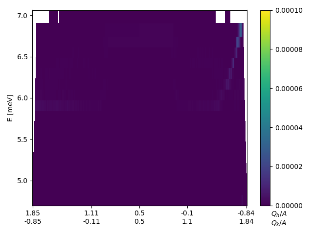
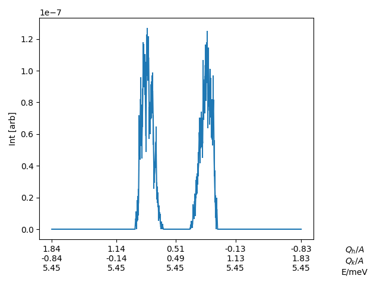
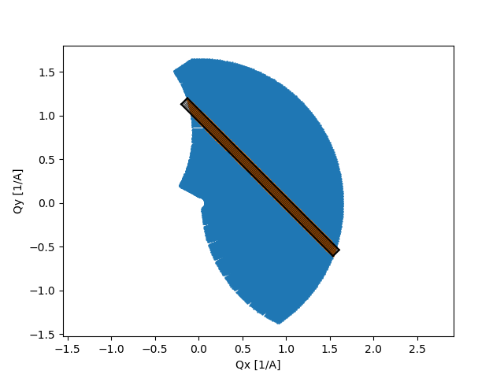

Q-energy cutting and visualization in 1 and 2 dimensions
^^^^^^^^^^^^^^^^^^^^^^^^^^^^^^^^^^^^^^^^^^^^^^^^^^^^^^^^

One feature needed when dealing with 3D intensity data is to be able to cut from q one point to another and investigate the energy dependency of the intensity. This can be done by invoking the cutQE or plotCutQE. These methods perform constant energy cuts between the given q points (q1 and q2) and then stiches them together. When hovering over a position, the nearest qx, qy, and energy center is shown as well as its intensity.

 .. literalinclude:: ../../Tutorials/cut2D.py
     :lines: 5-21,34- 
     :language: python
     :linenos:

.. _cut2DPlot_fig1: 

Figure created by the DataSet method plotCutQE showing a phonon dispersion when cutting from (1,0) to (0,1). The c-axis is simply found from the minimal and maximal values of the binned intensities.

.. .. _PowderPlot_fig2: 

... figure:: ../../Tutorials/cut2DPlotCLim.png
..   :width: 45% 

.. The same plot as above but with the c-axis adjusted to a sensible value.

If one instead of a full map is only interested in a 1D cut, this can be achieved by the use of the (plot)cut1D method. It takes the same types of arguments as the 2D cutter with the exeption of maximal and minimal energies instead of energy bins.

 .. literalinclude:: ../../Tutorials/cut2D.py
     :lines: 5-10,26-29,34- 
     :language: python
     :linenos:

The above code cuts along the same direction as the 2D tool, but produces the two pictures below

.. _cut2DPlot_fig3: 

Figure created by the DataSet method plotCut1D showing a cut through a phonon dispersion when cutting from (1,0) to (0,1) and summing energies between 5.2 meV and 5.7 meV. 

.. _PowderPlot_fig4: 

The points used in the binning algorithm where the black boxes denotes individual bins.
