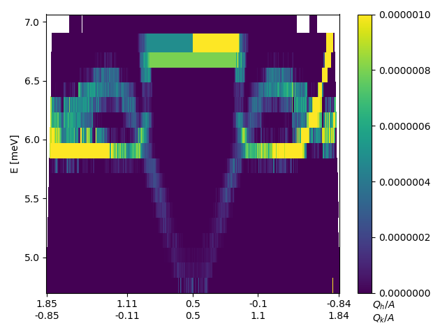

Q-energy cutting and visualization
^^^^^^^^^^^^^^^^^^^^^^^^^^^^^^^^^^

One feature needed when dealing with 3D intensity data is to be able to cut from q one point to another and investigate the energy dependency of the intensity. This can be done by invoking the cutQE or plotCutQE. These methods perform constant energy cuts between the given q points (q1 and q2) and then stiches them together. When hovering over a position, the nearest qx, qy, and energy center is shown as well as its intensity.

 .. literalinclude:: ../../Tutorials/cut2D.py
     :lines: 4-  
     :language: python
     :linenos:

.. _cut2DPlot_fig1: 

.. figure:: ../../Tutorials/cut2DPlot.png
   :width: 45% 

Figure created by the DataSet method plotCutQE showing a phonon dispersion as well as a spurious signal when cutting from (1,0) to (0,1). The c-axis is simply found from the minimal and maximal values of the binned intensities.

.. _PowderPlot_fig2: 

The same plot as above but with the c-axis adjusted to a sensible value.

